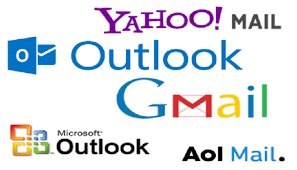

import { shareArticle } from '../../../components/share.js';
import { FaLink } from 'react-icons/fa';
import { ToastContainer, toast } from 'react-toastify';
import 'react-toastify/dist/ReactToastify.css';

export const ClickableTitle = ({ children }) => (
    <h1 style={{ display: 'flex', alignItems: 'center', cursor: 'pointer' }} onClick={() => shareArticle()}>
        {children} 
        <FaLink size="0.6em" />
    </h1>
);

<ToastContainer />

<ClickableTitle>Email Templates</ClickableTitle>

Email Templates allow you to customize the content of any notification that is sent by the platform, whether confirmation to the submitter that their submission has been received, or that a submission has been assigned to a reviewer.

## **Auto-generated Emails**

Certain triggers in the platform can be configured to notify a user. Currently, the following triggers are supported:

### Submission

* **Submission Received** -  A confirmation email is sent to the submitter when the platform has received their submission.
* **Submission Withdrawn** - If allowed to withdraw, a confirmation email is sent to the submitter upon withdrawal.

### Review

* **Submission Assigned to Reviewer** - Email is sent to all assigned reviewers with the quick link to the submission for review.
* **Review Received** - After completion of review the reviewer receives email confirmation of completed review.

When creating/modifying a *call*, the platform administrator may configure which template to use for each of the above trigger types and many more, also configurable on the respective Submission phase or Review-phase as a single use.

Configure bcc-copy certain e-mail addresses (separate via comma) for any triggers happening in a call-phase:

### Emails Instructions

1. From the home page select the **Emails** tile or from the left pane

2. Select the **CREATE NEW TEMPLATE** button

3. Type in title of email in the **Template Name** field to ***Save as***

4. In the Event Type section click inside the drop-down menu to expand subject options by **Event Type** (triggers)

5. Fill in **Subject** line and body of content ***ENGAGE WITH YOUR USERS!!***

6. Select **SAVE**

### Placeholders

Slayte has **a special kind of selector** known as a “placeholder”. It looks and acts a lot like a class selector, but it starts with a @ and it's not included in the CSS output. Unlike class selectors, placeholders don’t clutter up the CSS if they aren’t extended.

Here's the list of placeholders that are available for type:

#### *Submission Received*

Your organization's name: **org/_name**
* Author first name: **author/_firstname**
* Author last name: **author/_lastname**
* Call name: **call/_name**
* Call UUID: **call/_uuid**
* Application's base url: **app/_baseurl**
* Submission UUID: **submission/_uuid**

#### *Submission Withdrawn*

* Your organization's name: **org/_name**
* Author first name: **author/_firstname**
* Author last name: **author/_lastname**
* Call name: **call/_name**
* Call UUID: **call/_uuid**
* Application's base url: **app/_baseurl**
* Submission UUID: **submission/_uuid**

#### *Review Assigned*

* Your organization's name: **org/_name**
* Reviewer first name: **reviewer/_firstname**
* Reviewer last name: **reviewer/_lastname**
* Call name: **call/_name**
* Call UUID: **call/_uuid**
* Application's base url: **app/_baseurl**
* Submission UUID: **submission/_uuid**

#### *Review Received*

* Your organization's name: **org/_name**
* Reviewer first name: **reviewer/_firstname**
* Reviewer last name: **reviewer/_lastname**
* Call name: **call/_name**
* Call UUID: **call/_uuid**
* Application's base url: **app/_baseurl**
* Submission UUID: **submission/_uuid**
* Review UUID: **review/_uuid**

