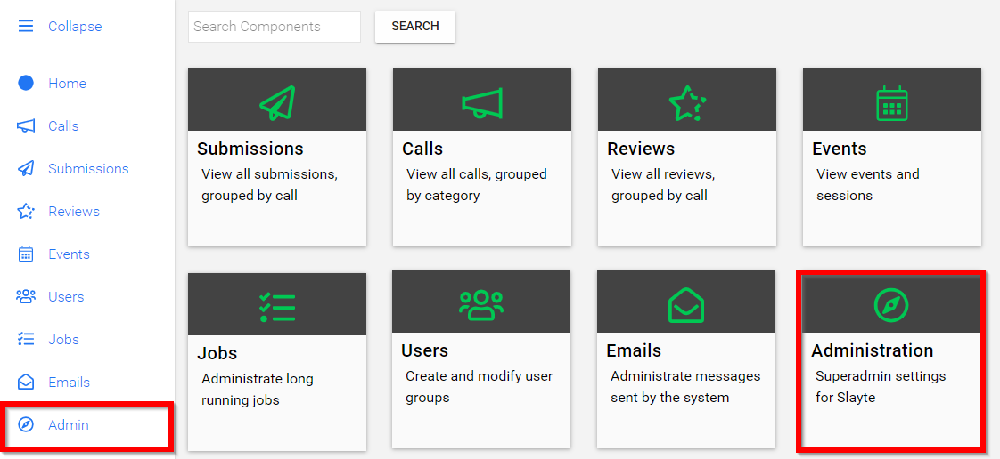
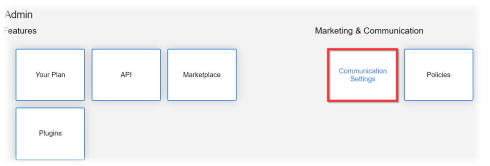
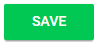

import { shareArticle } from '../../../components/share.js';
import { FaLink } from 'react-icons/fa';
import { ToastContainer, toast } from 'react-toastify';
import 'react-toastify/dist/ReactToastify.css';

export const ClickableTitle = ({ children }) => (
    <h1 style={{ display: 'flex', alignItems: 'center', cursor: 'pointer' }} onClick={() => shareArticle()}>
        {children} 
        <FaLink size="0.6em" />
    </h1>
);

<ToastContainer />

<ClickableTitle>Marketing & Communication Settings</ClickableTitle>

This page is designated for Super Administrators to allow the changes for outgoing emails to submitters and reviewers and much more.

1. From the Home page select **Administration**

2. Under Marketing & Communication select **Communication Settings**

3. Select **Edit** to change the following:

* Communication E-Mail Address
* Support message when submitting is not allowed
* Communications E-Mail Name
* Organization Name
* Always BCC

4.  Select **SAVE** when finished

Please note, this does ***NOT*** change the DNS Settings of your mail service. If you wish to have emails sent on behalf of your organization/association, please send email to [support@slayte.com](mailto:support@slayte.com) to request Mail Server Instructions.

