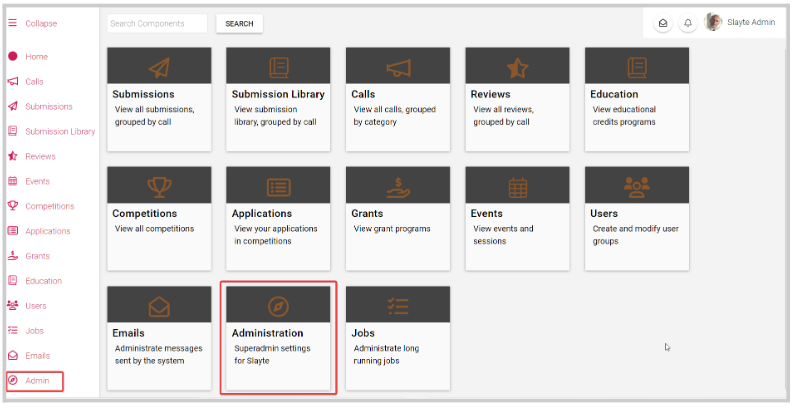
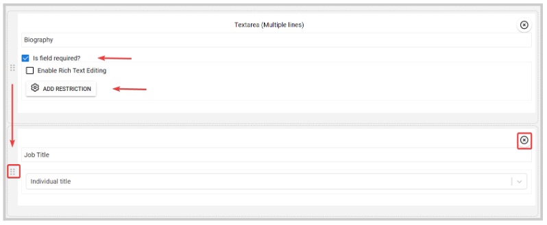
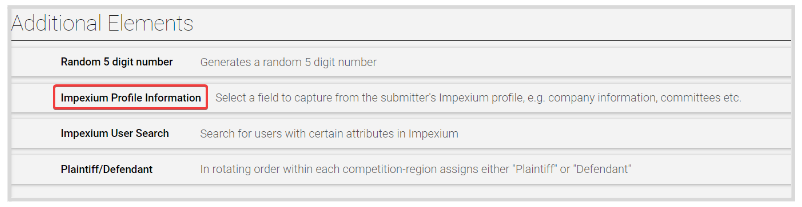
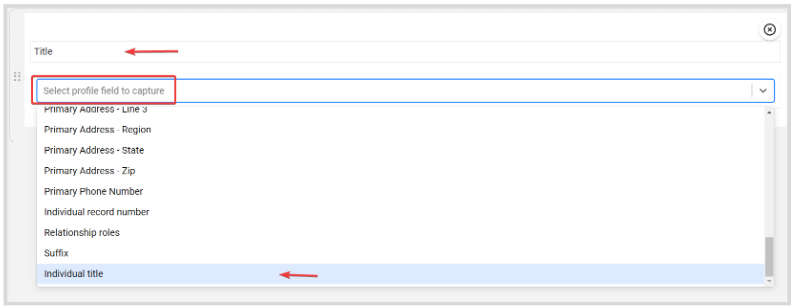
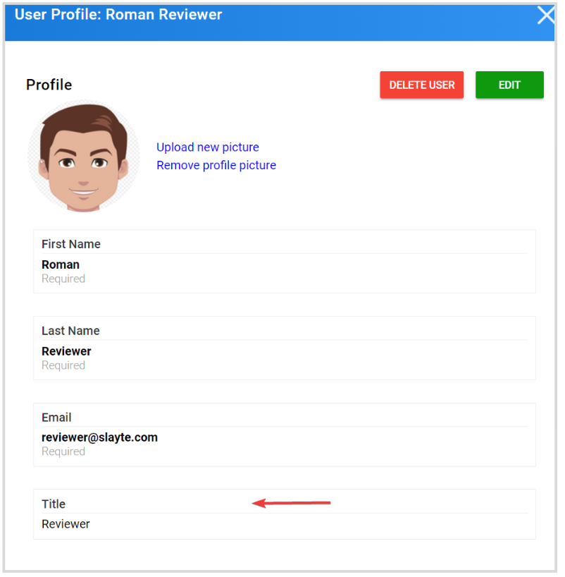

import { shareArticle } from '../../../components/share.js';
import { FaLink } from 'react-icons/fa';
import { ToastContainer, toast } from 'react-toastify';
import 'react-toastify/dist/ReactToastify.css';

export const ClickableTitle = ({ children }) => (
    <h1 style={{ display: 'flex', alignItems: 'center', cursor: 'pointer' }} onClick={() => shareArticle()}>
        {children} 
        <FaLink size="0.6em" />
    </h1>
);

<ToastContainer />

<ClickableTitle>User Profile Customization</ClickableTitle>

As part of the user's setup, you can specify the user profile fields to display for users to fill for their account profile

1. Go to **Admin** or **Administration**

   
2. Under the **Users** section, click the **Profile** tile   
3. Click **Add field** and select the desired field to use

**/*/*NOTE:** The following fields are already part of the default user profile and should not be added to the user profile template: First Name, Last Name, Email, and Profile Image. Also, the order of these fields cannot be rearranged

4. You can decide if the field is required/optional or add a restriction such as Min/ Max # of characters. You can also re-arrange the order of the new fields, or remove them if no longer needed

5. Once you have added all fields, click **Save** at the bottom

## Impexium Profile Information Field

You can add Server Fields to user profiles, to easily display details such as Organization, Title, and Biographies from Impexium. This feature will allow you to present user information in conference settings and other areas across the platform

1. Click **Add Field**, and you can find this field type under the **Additional Elements** section

2. Type the display **name** for the field and select the **Impexium profile field to capture**

3. Once done, click **Save**

These additional fields will be added under the default fields on the user's profile window

**Note:**these **Server Fields** cannot be manually edited in Slayte, therefore we recommend you create the users in the AMS before connecting them to Slayte. This ensures that the user's information is properly captured and displayed even if they never log into either platform

