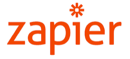

import { shareArticle } from '../../../components/share.js';
import { FaLink } from 'react-icons/fa';
import { ToastContainer, toast } from 'react-toastify';
import 'react-toastify/dist/ReactToastify.css';

export const ClickableTitle = ({ children }) => (
    <h1 style={{ display: 'flex', alignItems: 'center', cursor: 'pointer' }} onClick={() => shareArticle()}>
        {children} 
        <FaLink size="0.6em" />
    </h1>
);

<ToastContainer />

<ClickableTitle>Zapier</ClickableTitle>

[**Zapier**](https://zapier.com/apps/slayte/integrations) integration is important for conference software because it allows for seamless automation and integration with other tools and applications. With Zapier, conference software can connect with a wide range of apps and services, streamlining processes and improving efficiency.

 

1. **Automation**: Zapier allows for the automation of repetitive tasks, such as sending out email reminders, updating calendars, and creating reports. This saves time and reduces the risk of human error.
2. **Improved Workflow**: Zapier integrates with various apps and services, allowing for the creation of workflows that bring together different tools and systems. This results in improved collaboration increased productivity and reduced manual effort.
3. **Customization**: Zapier offers a flexible and customizable platform, allowing businesses and organizations to tailor their integrations to their specific needs and requirements.
4. **Cost-effective**: Zapier is a cost-effective solution that eliminates the need for expensive custom integrations. This makes it an attractive option for businesses and organizations of all sizes.
5. **Reliability**: Zapier is a reliable platform that ensures integrations run smoothly and as intended. The platform is constantly updated and improved, ensuring that users always have access to the latest features and capabilities.

In conclusion, Zapier integration is important for conference software because it enhances automation, improves workflows, offers customization, is cost-effective, and is reliable. These benefits make Zapier a valuable addition to any conferencing software, enabling users to get the most out of their tools and applications.

