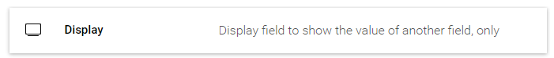
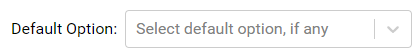
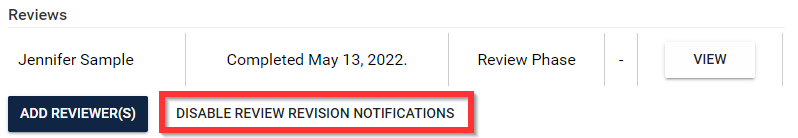
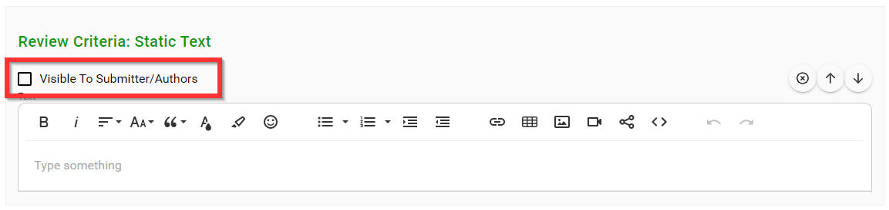
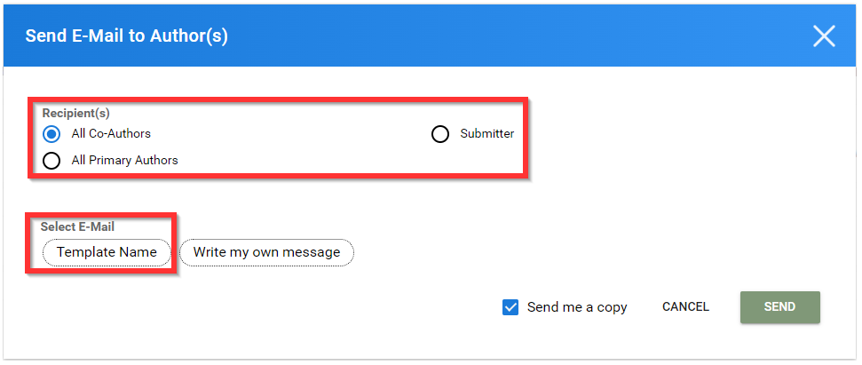

import { shareArticle } from '../../../components/share.js';
import { FaLink } from 'react-icons/fa';
import { ToastContainer, toast } from 'react-toastify';
import 'react-toastify/dist/ReactToastify.css';

export const ClickableTitle = ({ children }) => (
    <h1 style={{ display: 'flex', alignItems: 'center', cursor: 'pointer' }} onClick={() => shareArticle()}>
        {children} 
        <FaLink size="0.6em" />
    </h1>
);

<ToastContainer />

<ClickableTitle>Release Notes 8/12/2022</ClickableTitle>

## Events Module

* Event attendees can now receive real-time notifications when a new chat message has been received on the platform.

## Submissions Module

* A new submission form field has been added, **Display**. This field allows the administrator to present information to the user in a ***Read Only*** format which can be dynamically updated.

	+ The display field further expands the capabilities and possibilities of the form builder in tandem with skip logic functionality. This allows the ability to evolve a submission dynamically for both the administrator and the end-user to collect data from different stages of the form.

* It is now possible to set a **default value** in fields with multiple values, such as but not limited to Dropdowns, Yes/No, and Single Select.

	+ This new functionality can be used in combination with skip-logic to further expand form-building possibilities.

* Administrators can **disable reviewer revision communications** on a per submission basis.

* New to the Review Phase, administrators can now enable specific submission form fields to be **Visible To Submitter/Authors**.

* The **email** communications feature has been re-designed

	+ Email options including specific **send-to options**
	
	
		- All Co-Submitters
		- Submitter
		- All Primary Submitters
	+ Administrators can easily modify a previously created email template on a per email basis.

## Several Fixes and QoL improvements

* Significantly improved performance for attendees when viewing the session list

	+ Accommodates significant performance improvements for events with 1000+ sessions
* Review Comment field type is now multiline, allowing for more rich and detailed review input
* Addressed an issue that would prevent updating time slots by dragging and dropping in calendar view for administrators in the event module
* The submissions library UI has been updated to be more compact and informative
* Updated the terminology of sessions with limited access from “Restricted” to “Locked”
* Re-designed Submission detail view, providing higher visibility of the tools at disposal of the users
* Updated visibility of reviews for the “Reviewer” role to only display active reviews
* Improved UX for Review Detail

For more information or training on the highlights, please click [here](https://calendly.com/slayte-success/training-2039856) to connect with your Customer Success Manager.

