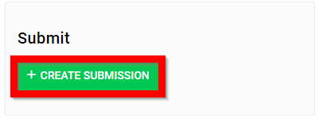
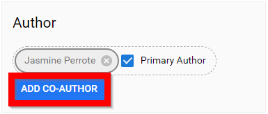
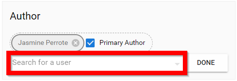
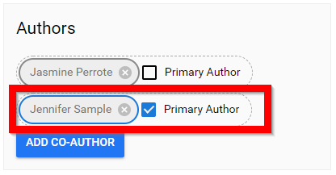
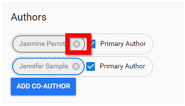
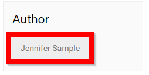

import { shareArticle } from '../../../components/share.js';
import { FaLink } from 'react-icons/fa';
import { ToastContainer, toast } from 'react-toastify';
import 'react-toastify/dist/ReactToastify.css';

export const ClickableTitle = ({ children }) => (
    <h1 style={{ display: 'flex', alignItems: 'center', cursor: 'pointer' }} onClick={() => shareArticle()}>
        {children} 
        <FaLink size="0.6em" />
    </h1>
);

<ToastContainer />

<ClickableTitle>(Impersonate) Submit On-behalf Of</ClickableTitle>

1. Navigate to the desired **call**

2. From the **ABOUT** menu scroll down to **CREATE SUBMISSION**

2. Select **ADD CO-AUTHOR**

3. Start typing in **name** of individual to submit on-behalf of

4. **Select individua**l to be Primary Author 

5. Select the **X** next to *your* name

6. **Complete** submission

7. **Review** the submission, please note, the Author will be as listed 

8. **SUBMIT** to complete

