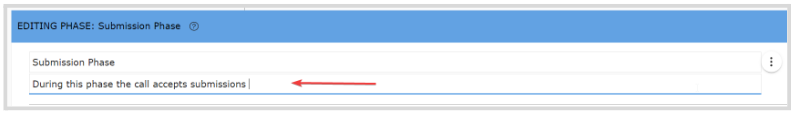

import { shareArticle } from '../../../components/share.js';
import { FaLink } from 'react-icons/fa';
import { ToastContainer, toast } from 'react-toastify';
import 'react-toastify/dist/ReactToastify.css';

export const ClickableTitle = ({ children }) => (
    <h1 style={{ display: 'flex', alignItems: 'center', cursor: 'pointer' }} onClick={() => shareArticle()}>
        {children} 
        <FaLink size="0.6em" />
    </h1>
);

<ToastContainer />

<ClickableTitle>Add an Additional Phase</ClickableTitle>

When needed, you can create an additional submission or review phase to an existing call as an extra step in your data gathering or call use case. 

1. Go to **Calls** and locate the **Call** you are looking to update 

2. Click the **Template** tab from the top bar

3. Under the submission or review phase section, click **+ Add Submission phase** or **+ Add Review Phase**which will automatically add the phase under the already existing one

****

4. Click **Edit** to update the form and settings as needed.

**Note:** when working with multiple phases keep in mind start/end date cannot overlap between phases.

5. Once done editing, click **Save** in the right top corner

## Rename phase

It is recommendable, but not required; when working with multiple phases to rename each phase to avoid confusion. To do so, follow these steps: 

1. From the **Template** tab, click **Edit** next to the phase you are looking to update 

2. In the **Editing Phase** section, you can rename the phase by typing the desired name in the first field

3. Click **Save**, on the right top corner

## Update Phase Description

When needed, you can update a phase description to include additional information about the project, instructions, etc. 

1. From the Template Tab, click Edit next to the phase you are looking to update

2. In the **Editing Phase** section, you can add/update the phase description by typing in the second field

3. Once done, click **Save** in the right top corner

