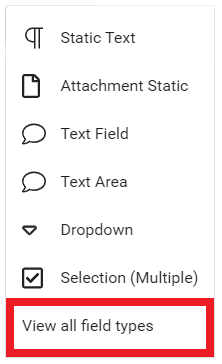
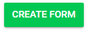

import React from 'react';
import { shareArticle } from '../../share.js';
import { FaLink } from 'react-icons/fa';
import { ToastContainer, toast } from 'react-toastify';
import 'react-toastify/dist/ReactToastify.css';

export const ClickableTitle = ({ children }) => (
    <h1 style={{ display: 'flex', alignItems: 'center', cursor: 'pointer' }} onClick={() => shareArticle()}>
        {children} 
        <FaLink size="0.6em" />
    </h1>
);

<ToastContainer />

<ClickableTitle>Additional Form</ClickableTitle>

This option will allow you to add another form within this field, where the submitter will be required to enter an email address of a recipient for the system to send a message with instructions to fill in the form. 

Common usage of this form is for reference requests. It is not required for the recipient to be logged in to fill out the form and respond.

1. Select **CREATE NEW SECTION**

2. **Name the section** by typing in the text field

3. Select **ADD FIELD**

4. Select **View all field Types**

5. From the Select Field page scroll down and select **Additional Form**

6. **Title** the form

7. Select **additional options** of Optional | Hide from reviewer | Hide in blind review

8. **Type instructions** for the submitter

9. Select **Additional information about recipient** recommended

10. Select **Can submitter see form response?**

11. Optional - select **Email Blind-Copy** then type in **email address**

12. Create Recipient Email Template starting with **subject line**

13. **Type** in Email Content 

/*Fill in subject and content of the email to the recipient. Type @ to see a list of available mail-merge placeholders that will be replaced when sending to the recipient.

**REQUIRED**: Ensure to add the placeholder **@Link to recipient** form to the body of the recipient email

14. Select **Create Form** for recipient 

15. **Title form** then select **ADD FIELD**

16. **Create Additional Form** with desired field types

17. Select **SAVE** when finished

18. Review the form select**EDIT** to revise form or **X** to close

19. Select **SAVE THIS FORM** to save

20. Select **SAVE** in the Call Template

From the recipient side, the user will be able to fill in the form with the standard form view:

