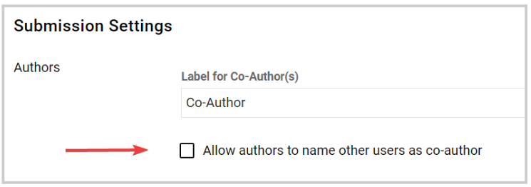

import React from 'react';
import { shareArticle } from '../../share.js';
import { FaLink } from 'react-icons/fa';
import { ToastContainer, toast } from 'react-toastify';
import 'react-toastify/dist/ReactToastify.css';

export const ClickableTitle = ({ children }) => (
    <h1 style={{ display: 'flex', alignItems: 'center', cursor: 'pointer' }} onClick={() => shareArticle()}>
        {children} 
        <FaLink size="0.6em" />
    </h1>
);

<ToastContainer />

<ClickableTitle>Allow Co-Author Collaboration</ClickableTitle>

Co-Authors can be added to submissions with more than one author. This feature allows the ability to tag multiple authors to a submission, to avoid each having to submit duplicates of work completed together.

## To Enable Co-Author(s)

1. Navigate to the desired submission phase

2. Under the Submission Settings section, click the **checkbox** to enable the feature

3. (Optional) You can rename or assign a new label to Co-Author(s) or Primary Author(s) by typing the name on each of the fields; into a familiar word for you and your team.

4. Additionally, you can enable the following functions:

* **Co-authors can be found by their email address**
* **Allow adding new users as co-authors**
* **Co-authors Opt-In**

5. Select **SAVE** in the right top corner to save the changes. 

