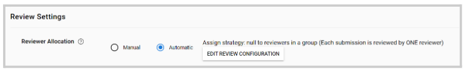
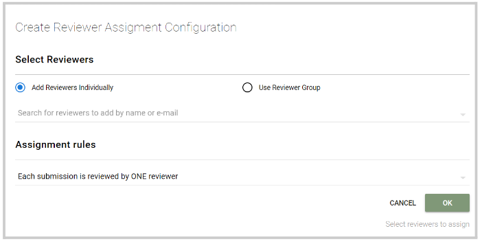
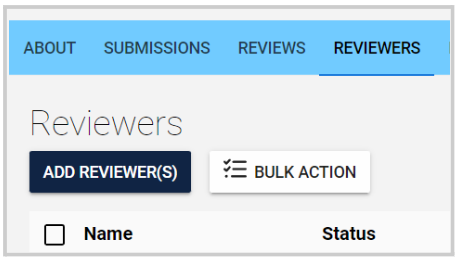
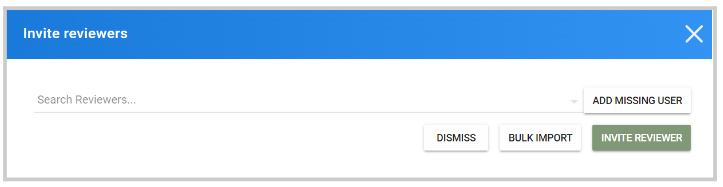
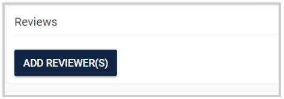
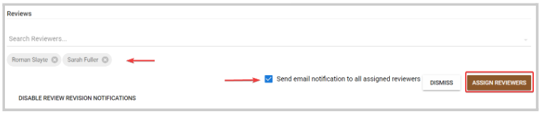
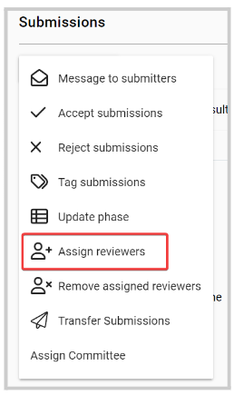
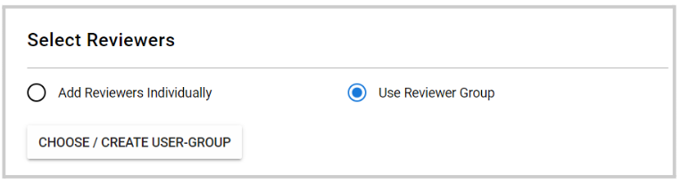
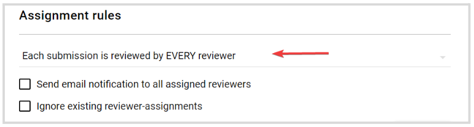

import React from 'react';
import { shareArticle } from '../../share.js';
import { FaLink } from 'react-icons/fa';
import { ToastContainer, toast } from 'react-toastify';
import 'react-toastify/dist/ReactToastify.css';

export const ClickableTitle = ({ children }) => (
    <h1 style={{ display: 'flex', alignItems: 'center', cursor: 'pointer' }} onClick={() => shareArticle()}>
        {children} 
        <FaLink size="0.6em" />
    </h1>
);

<ToastContainer />

<ClickableTitle>Assign Reviewers</ClickableTitle>

For your Submissions, you can assign an individual reviewer or a [reviewer group](https://docs-for-customers.slayte.com/hc/en-us/articles/17278292505107) to assist with the review and evaluation process. You can add them either at the moment of creating the Call or once created. 

When creating the Call > Step 2 (Configuration) you can specify for the allocation to be “Manual” or "Automatic" under the Review Settings section:

## **Automatic**

If Automatic is selected, you will be asked to assign the reviewer/ reviewer group that will be automatically used for the upcoming submissions: 

## **Manual**

When selecting Manual, once the Call is created, you can have the following options to assign reviewers: 

## 

## **Volunteer reviewer Invitation**

This tool provides an opportunity to invite external individuals to join our platform as volunteer reviewers for your submissions. It's a strategic approach when your existing pool of reviewers is limited or non-existent, opening the door to a broader range of perspectives. Moreover, these volunteer reviewers have the flexibility to specify their availability as per their convenience.

 

To invite, from the Reviewers tab > click the Add Reviewer bottom: 

In the pop-up window, search or add if not listed internally the desired reviewer. A notification will be sent to the reviewer’s email address for this person to accept our decline to the invitation to be available as s reviewer. 

## 

## **Assignment of a single submission**

Directly from the Submission: view/open the submission, under the **Reviews** section click the **Add reviewers** bottom.

Search by name or email address of the individual reviewer or reviewer group, then click **Assign Reviewers.**Note: you can add multiple reviewers/reviewer's groups at a time, and decide to send a notification about the assignment. 

## **Bulk Assignment**

From the Submissions list, you can select as many submissions as you want, click **Bulk action** on the left top corner, and select from the drop-down menu **Assign Reviewers**

From here, you can select the following: 

* Select Reviewers: you can add individual reviewers or choose/create a reviewers group

* Assignment rules: select how the assignment will take place if a submission is reviewed by one reviewer, reviewer by every reviewer, or a custom assignment. You can also decide to **Send email notifications to all assigned reviewers** and **Ignore existing reviewer-assignments**

****

