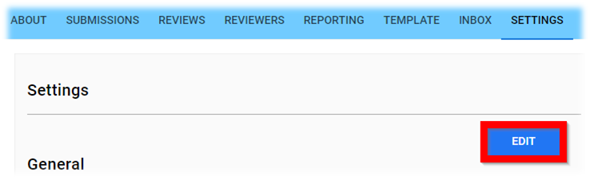
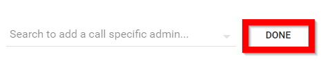
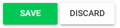
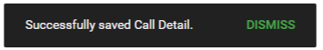

import { shareArticle } from '../../../components/share.js';
import { FaLink } from 'react-icons/fa';
import { ToastContainer, toast } from 'react-toastify';
import 'react-toastify/dist/ReactToastify.css';

export const ClickableTitle = ({ children }) => (
    <h1 style={{ display: 'flex', alignItems: 'center', cursor: 'pointer' }} onClick={() => shareArticle()}>
        {children} 
        <FaLink size="0.6em" />
    </h1>
);

<ToastContainer />

<ClickableTitle>Assign Specific Call Admins / Chair / Manager</ClickableTitle>

1. Select the desired call to assign Specific Call Admin / Chair / Manager

2. Select **SETTINGS** from the menu

3. Select **Edit**

4. Select **EDIT** next to ***Specific Call Admins*** or ***Chair / Manager***

5. **Type** in the individual's name, select from the drop down menu then select **DONE**

6. Select **SAVE** to complete changes

7. The platform will notify you of **successfully saving call details**

