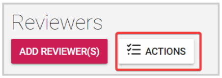
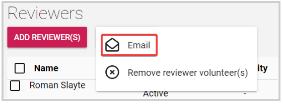
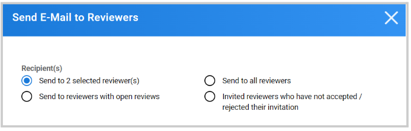
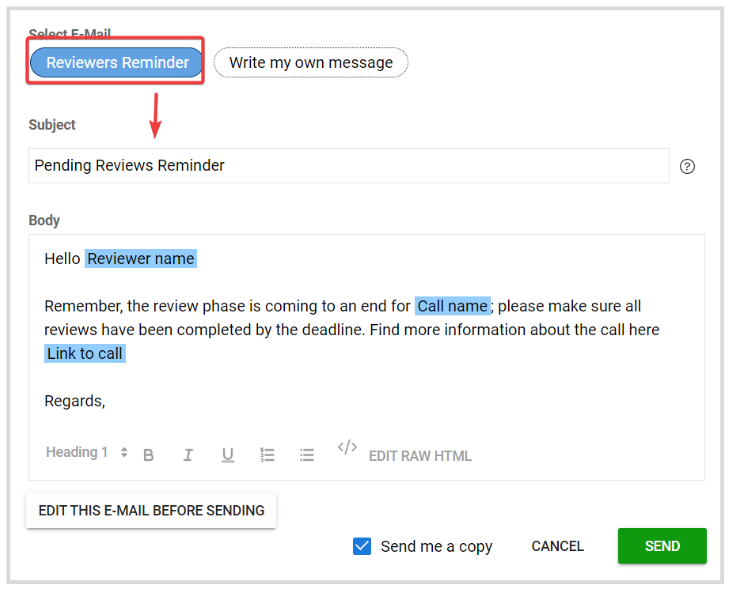
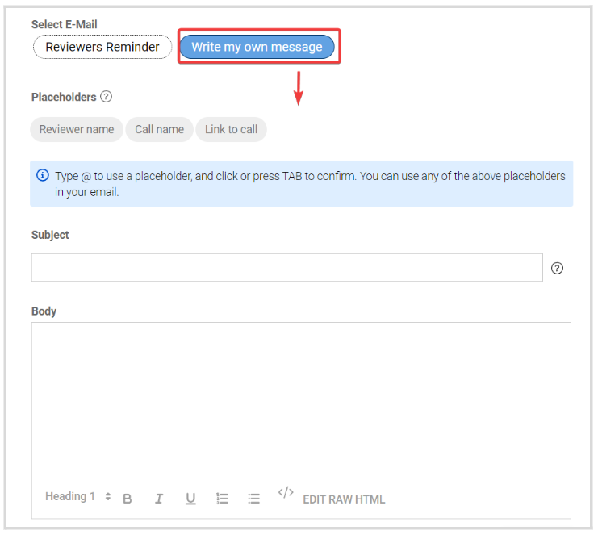

import { shareArticle } from '../../../components/share.js';
import { FaLink } from 'react-icons/fa';
import { ToastContainer, toast } from 'react-toastify';
import 'react-toastify/dist/ReactToastify.css';

export const ClickableTitle = ({ children }) => (
    <h1 style={{ display: 'flex', alignItems: 'center', cursor: 'pointer' }} onClick={() => shareArticle()}>
        {children} 
        <FaLink size="0.6em" />
    </h1>
);

<ToastContainer />

<ClickableTitle>Bulk Email Reviewers</ClickableTitle>

1. Go to **Calls**, and click the desired call 

2. Click the **Reviewers** tab from the top bar 

3. You can select specific reviewers or all from the list, then click **Actions**

****

4. From the pop-up menu, select **Email**

5. **Select Recipient(s)**: selected reviewer(s), reviewers with open reviews, all reviewers, or invited reviewers who have not accepted/rejected their invitation  

6. In the **Select Email** section, you can select to use a **Predefined Template**

****

**Note:**Find the steps on how to create email templates [here](https://docs-for-customers.slayte.com/hc/en-us/articles/115001375093-Email-Templates)

Or **Write your own message** from scratch 

**Note:** You can use **placeholders** (Reviewer name, Call name, Link to call) to pull this information and automatically populates on each message and request to **send me a copy**if desired for your records. 

7. Click **Send**

