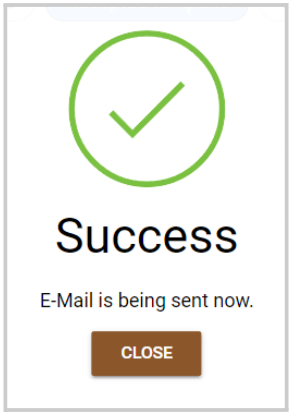

import { shareArticle } from '../../../components/share.js';
import { FaLink } from 'react-icons/fa';
import { ToastContainer, toast } from 'react-toastify';
import 'react-toastify/dist/ReactToastify.css';

export const ClickableTitle = ({ children }) => (
    <h1 style={{ display: 'flex', alignItems: 'center', cursor: 'pointer' }} onClick={() => shareArticle()}>
        {children} 
        <FaLink size="0.6em" />
    </h1>
);

<ToastContainer />

<ClickableTitle>Bulk Email Submitter(s)</ClickableTitle>

As an Administrator, you can easily communicate with some or all submitters with the Message Submitters function, on a per-call basis. 

1. Go to Calls, and select the desired call 

2. Click **Submissions** from the top bar 

3. From the submission list view, select a submission by checking the box to the left. You can choose only the submissions that apply or all. 

4. Once submissions have been selected, click the **Bulk Action** button 

5. Select **Message to submitters**

6. From the pop-up window, you can select: 

* **Recipient(s):** All Co-Authors, Submitter, or All Primary Authors
* **Select E-Mail:** you can select from an existing template or **write my own message** to start from scratch
* **Send me a copy:** for you to receive a copy of the message to your primary email

7. Click **Send E-Mail to Author(s) for X Submissions** 

8. You will receive the following confirmation 

