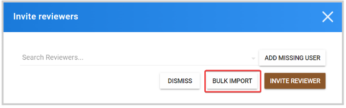
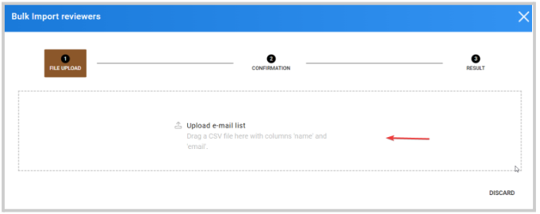
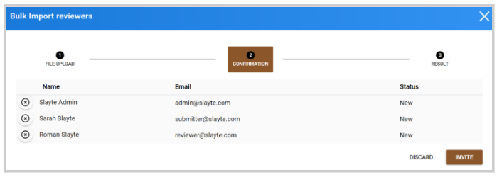
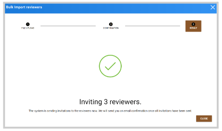
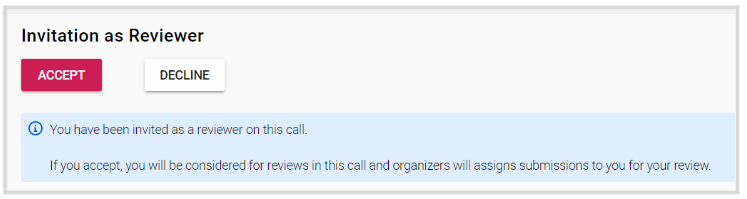

import { shareArticle } from '../../../components/share.js';
import { FaLink } from 'react-icons/fa';
import { ToastContainer, toast } from 'react-toastify';
import 'react-toastify/dist/ReactToastify.css';

export const ClickableTitle = ({ children }) => (
    <h1 style={{ display: 'flex', alignItems: 'center', cursor: 'pointer' }} onClick={() => shareArticle()}>
        {children} 
        <FaLink size="0.6em" />
    </h1>
);

<ToastContainer />

<ClickableTitle>Bulk Import Reviewers Invite</ClickableTitle>

1. From the desired call, click the **Reviewers** tab from the top bar 

2. Click **Add Reviewer(s)**

3. From the Invite Reviewer window, click **Bulk Import**

4. Click to select a file or drag the file in the **Upload e-mail list** section. The CSV file needs to have the columns "name" and "email" and all email addresses are valid.

5. Once successfully uploaded, a preview of the reviewer's details will show. Click **Invite** to continue 

6. You will receive the following confirmation 

Reviewers can accept/decline the invite from the email sent or from the call main page as below

