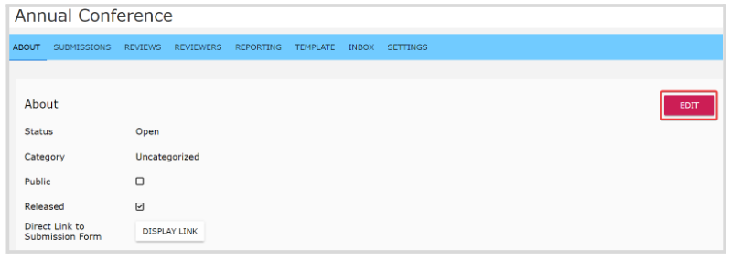
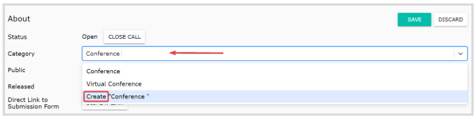
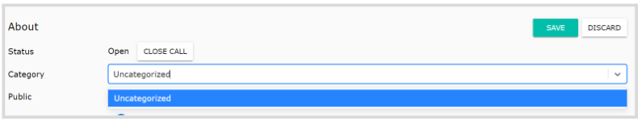

import React from 'react';
import { shareArticle } from '../../share.js';
import { FaLink } from 'react-icons/fa';
import { ToastContainer, toast } from 'react-toastify';
import 'react-toastify/dist/ReactToastify.css';

export const ClickableTitle = ({ children }) => (
    <h1 style={{ display: 'flex', alignItems: 'center', cursor: 'pointer' }} onClick={() => shareArticle()}>
        {children} 
        <FaLink size="0.6em" />
    </h1>
);

<ToastContainer />

<ClickableTitle>Call Categories</ClickableTitle>

You can create different categories to organize your calls based on the criteria of your choice. Once you create Categories for your Calls, you will see the Categories listed on the top-level Calls page.

## Create/ Assign Category to a Call

1. From the main menu, go to **Calls**   
2. Click on the desired Call tile   
3. From the **About** tab, click **Edit** to the right

4. By default, the call is **uncategorized**. In the Category field, type to search by name an existing category or create a new one by typing the name to use. Press enter or click the field when ready.   

5. Click **Save**

## Remove Category

You can remove a category if no longer needed, or are still unsure of how to categorize the call. Click **Edit** again from the **About** Page and in the category field search and select **Uncategorized**instead. 

****

