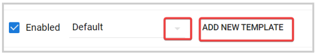

import React from 'react';
import { shareArticle } from '../../share.js';
import { FaLink } from 'react-icons/fa';
import { ToastContainer, toast } from 'react-toastify';
import 'react-toastify/dist/ReactToastify.css';

export const ClickableTitle = ({ children }) => (
    <h1 style={{ display: 'flex', alignItems: 'center', cursor: 'pointer' }} onClick={() => shareArticle()}>
        {children} 
        <FaLink size="0.6em" />
    </h1>
);

<ToastContainer />

<ClickableTitle>Call Configuration: Communication Settings</ClickableTitle>

Updates in the system can trigger notifications, to Administrators, Reviewers, and Submitters. Per call, the administrator can configure how frequently these notifications should be delivered.

## **Submitter Communication**

Submitters can be notified about the following events:

* Submission has been received.
* Submission Withdrawn.
* Their submission was rejected or accepted

## **Reviewer Notifications**

Reviewers can be notified about the following events:

* They have been assigned reviewer for a call.
* A submission has been assigned to them (either automatically or manually).

According to both "Submitter and Reviewer Notifications" settings, they can either receive these notifications:

* Instant - Right after the event happened
* Off - No notifications should be delivered

Also, Administrators can enable/disable these notifications at a Call level or per submission/review phase basis when using multiple phases. 

### **Call Level**

1. From the desired call, go to **Settings** from the top bar

2. Click Edit on the right-top corner 

3. Scroll down to **Submission Settings**or **Review Settings**as needed

4. In the **Communication** field, **c****heck/uncheck** the box next to **Enable Submitter Notifications** or **Enable Reviewer Notifications**

5. Click **Save** in the right top corner.

### **Phase Level**

1. From the desired call, go to **Template** from the top bar

2. Next to the phase to update, click **Edit**

3. Scroll down to the **Communication with Submitters** or **Communication with Reviewers** section, and click the click checkbox **Override call configuration for this phase**

4. (Optional) You can enable **E-mail blind-copy**by checking the box. A blind/bcc-copy specific e-mail address for any event happening in this phase. In the field, separate each email address with a comma. Whoever receives the original notification will not know that these email addresses also received the notification.

5. In the **Event Communication** section, check/uncheck the type of notification to enable/disable for either Submitter or Reviewer. 

6. You can leave Default for a generic/ system default generated message to be used for this notification, or you can personalize the message to use by clicking **Add New Template**or selecting an existing one from the drop-down menu 

7. Once agreed with the configuration, click **Save** in the right top corner.

