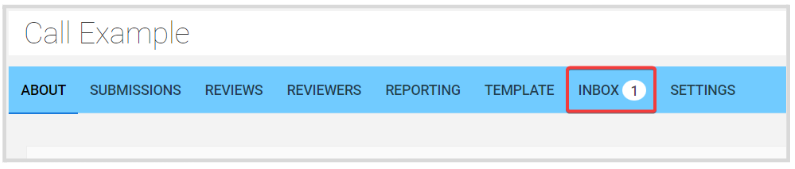
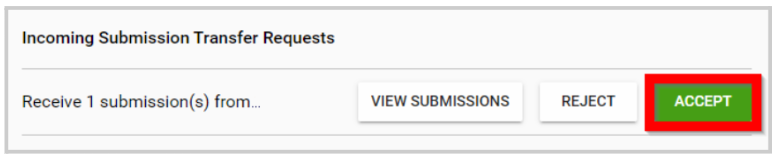

import React from 'react';
import { shareArticle } from '../../share.js';
import { FaLink } from 'react-icons/fa';
import { ToastContainer, toast } from 'react-toastify';
import 'react-toastify/dist/ReactToastify.css';

export const ClickableTitle = ({ children }) => (
    <h1 style={{ display: 'flex', alignItems: 'center', cursor: 'pointer' }} onClick={() => shareArticle()}>
        {children} 
        <FaLink size="0.6em" />
    </h1>
);

<ToastContainer />

<ClickableTitle>Call Inbox</ClickableTitle>

As an Administrator, you'll have an Inbox for the call specific messages/notifications. When there's a pending/unseen message or notification, you will have a number alert next to the Inbox tab. 

Here you can find the following type of notifications: 

## Reviewer Recusals

A Reviewer has recused to review a submission, from here you can confirm the Reviewer's name, a direct submission link, you can immediately reassign the submission to another review and confirm recusal. 

## Incoming Submission Transfer Request

When transferring a submission from one call to another, you are required to accept/decline this transfer from the Inbox. 

 

