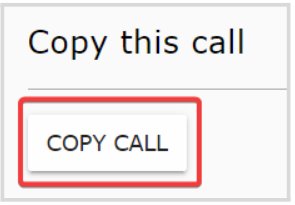
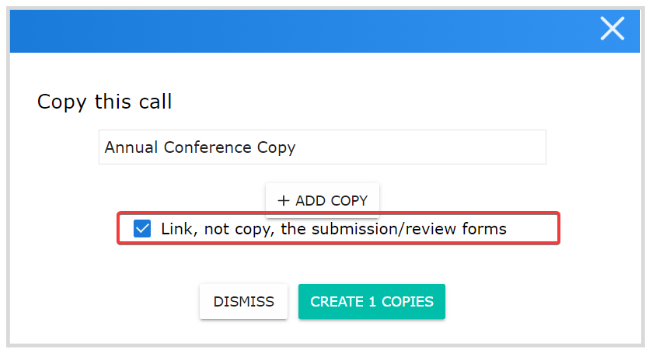

import { shareArticle } from '../../../components/share.js';
import { FaLink } from 'react-icons/fa';
import { ToastContainer, toast } from 'react-toastify';
import 'react-toastify/dist/ReactToastify.css';

export const ClickableTitle = ({ children }) => (
    <h1 style={{ display: 'flex', alignItems: 'center', cursor: 'pointer' }} onClick={() => shareArticle()}>
        {children} 
        <FaLink size="0.6em" />
    </h1>
);

<ToastContainer />

<ClickableTitle>Call Linking</ClickableTitle>

When needed, you can link two or more calls to be able to transfer submissions between them. Please note, the submission form format needs to match exactly on **ALL** calls involved, and the Calls need to be Open/Released to be able to receive those transferred submissions.

1. From the desired call you want to copy and link, go to the **Settings**tab from the top bar

2. Scroll down to the **Copy this call** section, and click **Copy Call**

****

3. From the pop-up window, assign the new call name and click the **checkbox** for **Link, not copy, the submission/review forms**

****

4. Click **Create #Copies**

This new Call will inherit all settings and submission/review (if applicable) forms, but no submissions, reviews, Inbox messages, or reviewer's assignments. Click **[here](https://docs-for-customers.slayte.com/hc/en-us/articles/13553075434643-Submissions-Bulk-Actions-)** for more information on how to transfer submissions between calls.

