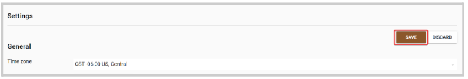

import React from 'react';
import { shareArticle } from '../../share.js';
import { FaLink } from 'react-icons/fa';
import { ToastContainer, toast } from 'react-toastify';
import 'react-toastify/dist/ReactToastify.css';

export const ClickableTitle = ({ children }) => (
    <h1 style={{ display: 'flex', alignItems: 'center', cursor: 'pointer' }} onClick={() => shareArticle()}>
        {children} 
        <FaLink size="0.6em" />
    </h1>
);

<ToastContainer />

<ClickableTitle>Call Time Zone</ClickableTitle>

When creating a Call, this comes with a default EST time zone. However, you can customize the time zone to you or your team's preference. 

1. Go to **Calls**, and click **Settings** from the top bar 

2. Click **Edit**

3. Under the **General** section, locate the **Time zone** field. From here, type the time zone name to search and click to select 

4. Once selected, click **Save**

