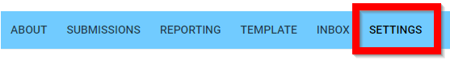
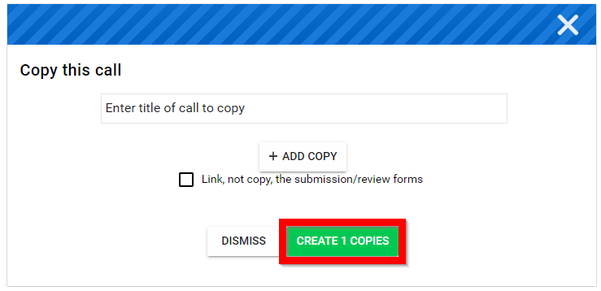
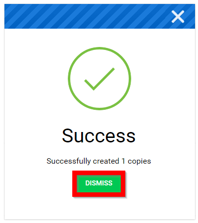

import { shareArticle } from '../../../components/share.js';
import { FaLink } from 'react-icons/fa';
import { ToastContainer, toast } from 'react-toastify';
import 'react-toastify/dist/ReactToastify.css';

export const ClickableTitle = ({ children }) => (
    <h1 style={{ display: 'flex', alignItems: 'center', cursor: 'pointer' }} onClick={() => shareArticle()}>
        {children} 
        <FaLink size="0.6em" />
    </h1>
);

<ToastContainer />

<ClickableTitle>Copy a Call</ClickableTitle>

This feature allows you to create a duplicate version of your Call.

1. Select the desired call to duplicate/copy

2. Select **SETTINGS** from the menu

3. Scroll down then select **COPY CALL**

4. In the Copy this call modal window **enter the title** of the new call that is being copied then select **CREATE *#* COPIES**

****

5. Select **DISMISS** then navigate to the **Calls** page to select your *newly copied* call

