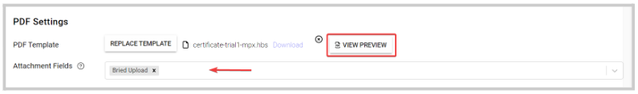

import React from 'react';
import { shareArticle } from '../../share.js';
import { FaLink } from 'react-icons/fa';
import { ToastContainer, toast } from 'react-toastify';
import 'react-toastify/dist/ReactToastify.css';

export const ClickableTitle = ({ children }) => (
    <h1 style={{ display: 'flex', alignItems: 'center', cursor: 'pointer' }} onClick={() => shareArticle()}>
        {children} 
        <span style={{ marginLeft: '10px' }}><FaLink size="0.6em" /></span>
    </h1>
);

<ToastContainer />

<ClickableTitle>Create Custom PDF Templates for Submissions Export</ClickableTitle>


As an administrator, one can specify, under the submission phase, a custom template to use and generate [PDF exports of individual submissions.](https://docs-for-customers.slayte.com/hc/en-us/articles/115009676927)


This is particularly useful when only specific information is needed to be included besides the default template or apply customized branding. The custom templates are built in HTML/CSS. Follow these steps to proceed:


1. Go to **Calls**, and select the desired call


2. Click **Template** from the top bar 


3. Next to the submission phase to update, click **Edit**


4. Scroll down to the **PDF Settings** section, and click **Upload Template.**Find below some template placeholders and a default PDF sample.


## Template Placeholders


|  |  |
| --- | --- |
| {{headerImageURL}} | Insert the logo defined under Slayte [Administrative Settings.](https://docs-for-customers.slayte.com/hc/en-us/articles/4412997300115) |
| {{submissionName}} | Fetches submission name value |
| {{callName}} | Fetches call name value |
| {{dateSubmitted}} | Fetches date submitted value |
| {{dateExported}} | Fetches date the PDF export was generated |
| {{linkToSubmission}} | Inserts a link to the submission online |
| {{submitterName}} | Inserts the name of the submitter |
| {{submitterEmail}} | Inserts email of the submitter |
| 
{{#each authorList}}

{{separator this ", "}} /*/ Can be used to separate authors/*/


{{getValue authorProfileFields
      "UUID"}}


...
...


{{#each authors}}


 | Lists each individual author and co-author associated with the submission, and also include any profile fields associated with the author. |
| 
{{#each sections}}
...
{{sectionTitle}
{{#each fields}}
{{fieldname}}
{{fieldValue}}
{{Each}}
 |  List all the sections of the submission, which can detail: section title, name of the field, and name of the value introduced by the submitter. |
| 
{{getFieldValue sections "sections.#.fields.#"}}
 | Specify individual values of the fields in the submission. This is particularly useful if the headers are not meaningful for the presentation of the PDF.
 
The pound sign should be replaced by the number of the section and field position, respectively, subtracted by one in each value
 
For example:
Section 1, field 1 = {{getFieldValue sections "sections.0.fields.0"}}
Section 2, field 3 = {{getFieldValue sections "sections.1.fields.2"}}
  |


 


### Sample Default PDF


```
<!DOCTYPE html>  
<head>  
<style>  
html {  
font-size: 10pt;  
font-family: Arial;  
}  
.row {  
display: flex;  
flex-direction: row;  
flex-wrap: wrap;  
width: 100%;  
}  
.column {  
display: flex;  
flex-direction: column;  
flex-basis: 100%;  
flex: 1;  
}  
.field-values {  
}  
.field-value, .field-value-small {  
display: flex;  
margin-bottom: 0.25rem;  
align-items: center;  
justify-content: center;  
}  
.field-value-small {  
font-size: 7pt;  
}  
.field-value .name, .field-value-small .name {  
font-weight: bold;  
margin-right: 1rem;  
text-align: right;  
flex-shrink: 0;  
flex-grow: 0;  
}  
.field-value .name {  
width: 12rem;  
}  
.field-value-small .name {  
width: 5rem;  
}  
.img-head {  
max-height: 10vh;  
}  
.header {  
align-items: center;  
margin-bottom: 2vh;  
}  
.header-info {  
margin-top: 15px;  
font-size: 7pt;  
}  
.img-head img {  
width: 100%;  
height: 100%;  
object-fit: contain;  
overflow: hidden;  
}  
.separator {  
margin-bottom: 10px;  
margin-top: 10px;  
font-size: 8pt;  
display: flex;  
color: rgb(200, 200, 200);  
width: 85%;  
margin-left: auto;  
margin-right: auto;  
align-content: center;  
align-items: center;  
justify-content: center;  
}  
.separator span {  
flex-grow: 1;  
text-align: center;  
}  
.separator hr {  
flex-grow: 4;  
flex-shrink: 0;  
background-image: linear-gradient(to right, rgba(200, 200, 200, 0), rgba(200, 200, 200, 0.75), rgba(200, 200, 200, 0));  
}  
hr {  
border: 0;  
height: 1px;  
background-image: linear-gradient(to right, rgba(0, 0, 0, 0), rgba(0, 0, 0, 0.75), rgba(0, 0, 0, 0));  
}  
</style>  
</head>  
<body>  
<div class="header">  
<div class="row">  
<div class="column img-head" style="flex-grow:1">  
  
</div>`  
<div class="column" style="flex-grow:2; text-align: center;">  
<h2>{{submissionName}}</h2>  
<h3>{{callName}}</h3>  
</div>  
<div class="column" style="flex-grow:1">  
<div class="header-info">  
<div class="field-value-small">  
<div class="name">Submitted:</div>  
<div class="value">{{dateSubmitted}}</div>  
</div>  
<div class="field-value-small">  
<div class="name">Exported:</div>  
<div class="value">{{dateExported}}</div>  
</div>  
<center>powered by <a href="https://www.slayte.com" target="_blank">www.slayte.com</a></center>  
</div>  
</div>  
</div>  
</div>  
<div class="row">  
<div class="field-value-small">  
<div class="name">Link to submission:</div>  
<div class="value" style="font-size: 5pt">  
<a href="{{linkToSubmission}}" target="_blank">{{linkToSubmission}}</a>  
</div>  
</div>  
</div>  
<h3>AUTHOR INFORMATION</h3>  
<div class="row">  
<div class="column">  
<div class="field-value">  
<div class="name">Submitter</div>  
<div class="value">{{submitterName}} ({{submitterEmail}})</div>  
</div>  
</div>  
<div class="column">  
<div class="field-value">  
<div class="name">Authors</div>  
<div class="value">{{#each authorList}}{{separator this ", "}}{{/each}}</div>  
</div>  
</div>  
</div>  
<h3>Authors List</h3>  
<div class="row">  
<ul>  
{{#each authors}}  
<li>{{authorName}} ({{getValue authorProfileFields "01bfb579-afb3-4db8-8b38-c3f49d530788"}}, {{getValue authorProfileFields "252fc821-a0a8-4cfc-8029-a75f96afc2ee"}}) </li>  
{{/each}}  
</ul>  
<hr />  
</div>  
<h2>Sections &amp; Fields</h2>  
<div class="row">  
{{#each sections}}  
Section {{sectionTitle}}<br />  
Fields:<br />  
{{#each fields}}  
{{fieldName}}: {{fieldValue}}<br />  
{{/each}}  
{{/each}}  
</div>   
<div>  
{{getFieldValue sections "sections.0.fields.2"}}  
</div>  
</body>  
</html>
```


5. Once the template has been created/selected, you can **View Preview** and define the allowed PDF attachments fields to be exported with the submissions 


**NOTE:** If you would like us to design a custom template for you, you can request a quote, email us to hello@slayte.com.

