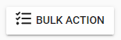
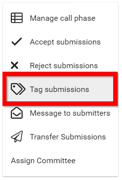
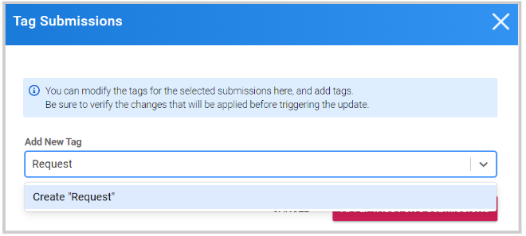
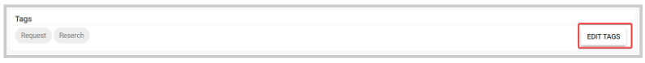
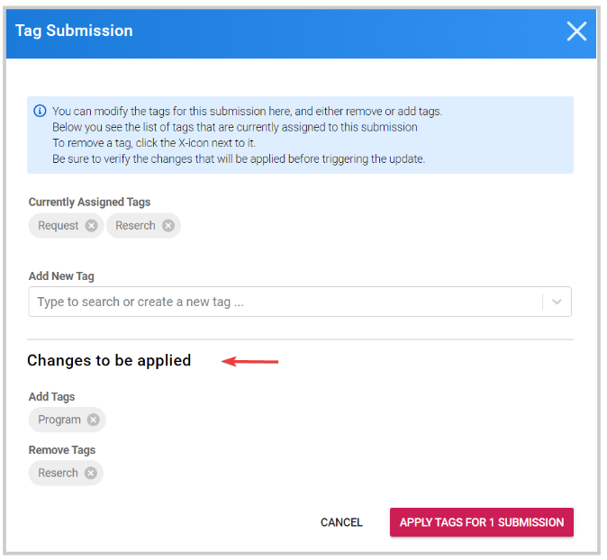

import { shareArticle } from '../../share.js';
import { FaLink } from 'react-icons/fa';
import { ToastContainer, toast } from 'react-toastify';
import 'react-toastify/dist/ReactToastify.css';

export const ClickableTitle = ({ children }) => (
    <h1 style={{ display: 'flex', alignItems: 'center', cursor: 'pointer' }} onClick={() => shareArticle()}>
        {children} 
        <FaLink size="0.6em" />
    </h1>
);

<ToastContainer />

<ClickableTitle>Create Tag(s)</ClickableTitle>

Tags are metadata assigned to submissions, that are entirely customizable! You can assign any tag to any number of submissions, and then filter for all submissions with this tag.

Tags are commonly used to indicate the stage of a submission in a workflow: "*Processed*", "*Pending*", "*Received*". They can also just be used as categories, e.g. "*Research*", "*Proposal*", "*Request*" or "*History*", "*Modernism*", "*Art*" etc.

## To Create a Tag

1. From the **Submissions** menu select one or more submissions, then click the **Bulk Action**button

2. Select **Tag submissions**

3. In the Bulk assign tags modal window, **type in the desired name** of the tag and click **Create** or **press enter**

****

4. Click **Apply Tags for # of Submissions.** You will then be able to **query submissions with the use of Tags**

**Please note**, you can also manage **Tags** individually from within the submission details page. 

1. Click **View**to the submission, and scroll down to the **Tags** section 

2. Click **Edit Tags**

3. From here, you can assign a new tag from the drop-down menu or remove a tag if no longer needed. You will have a preview of the changes before you click on Apply Tags

