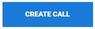

import React from 'react';
import { shareArticle } from '../../share.js';
import { FaLink } from 'react-icons/fa';
import { ToastContainer, toast } from 'react-toastify';
import 'react-toastify/dist/ReactToastify.css';

export const ClickableTitle = ({ children }) => (
    <h1 style={{ display: 'flex', alignItems: 'center', cursor: 'pointer' }} onClick={() => shareArticle()}>
        {children} 
        <FaLink size="0.6em" />
    </h1>
);

<ToastContainer />

<ClickableTitle>Create a Call</ClickableTitle>

## Step 1: Fill in a Call Name, Category and Description

1. From the Homepage select **Calls**

2. Select **CREATE NEW CALL**

3. Type in a **title** for the call then enter a **description** in the Introduction to address all prospective submitters this should include information about the call, guidelines, and submission instructions

4. Select the call **Category** that will be used to group calls together on the Calls page

5. Select **NEXT** to move to the CONFIGURATION

Step 2: Adjust Call Settings

You may want to customize branding to your Call, or set up automated Call notifications to be sent out when users complete certain actions in Slayte. 

1. Select **UPLOAD BANNER IMAGE** to select/import logo or desired image (Upload a banner image file that you want to appear in your call page. Best dimensions are 4x1 (WxH), e.g. w1600 x h400.) 
 
 2. Enable/Disable **Communication Settings**
* **Submitter Communication** By default the communication is enabled, to turn off notifications simply deselect the checkbox.
* **Reviewer Notifications** By default the communication is enabled, to turn off notifications simply deselect the checkbox.

3. Complete the **Review Settings**
* Set the tone for **Manual/Automatic** review settings
* Enable/Disable **Blind Reviews** which hides submitter's identity from the reviewers
* Enable/Disable **Shared Reviews** which allows reviewers to see other reviews

4. Select the **Time zone**
* To change from the default simply delete the entry then a drop down menu will display all time zones. You can also type in to narrow down search results.

5. Select **NEXT** to move to the ***TEMPLATE section***

Step 3: Configure your Call Template

Add a Submission Phase

1.  Select **Add Submission Phase** then select **EDIT**
Optional - Rename the Submission Phase this is recommended for multiphases 

2. Select the **date(s)** in which the call can will allow submission entry (Please note, if you have more than one Submission Phase it is important that the dates from each Submission Phase **do NOT overlap** - Submitters will encounter an error message when submitting.)

3. Select from an existing **Submission Form** or **[Create FORM](https://docs-for-customers.slayte.com/hc/en-us/articles/4412998428307)**(please click [here](https://docs-for-customers.slayte.com/hc/en-us/articles/4412998428307) for information about Slayte Form Builder Field Options)  
Optional -  Enable the ability to allow authors to name other users as co-author
* You will be able to change the nomenclature of Primary Author by typing in the field
	+ Enable/Disable the following:
		- Co-authors can be found by their email address
		- Allow adding new users as co-authors
		- Co-authors Opt-In

4. Complete the **Submission Settings**
* **Who can submit** Set the access restrictions for types of users who can submit into this phase. A variety of different types of restrictions are available.
* **Name Generator** Specify the scheme for identifying each submission to this phase. Choose from running numbers, colors, a random number, or the contents of a field in the submission form.
* **Payment Option** Configure to enforce that to make a submission a payment must be made. Select the payment processor to use (Impexium, or Stripe) and which product should be used to process the payment.
* Select if, Allow Withdrawal
* Set maximum submissions per single user
* Enable/Disable authors can edit submissions

5. Complete the **Communication with Submitters** section

Add a Review Phase (Optional)

1. Select **ADD REVIEW PHASE** then select **EDIT**

2. Select the **Times** button and select dates reviews will be accepted

3. Select **CREATE FORM**

4. **Title** the Review Form 

5. Select [**ADD REVIEW CRITERIUM**](https://docs-for-customers.slayte.com/hc/en-us/articles/4412806652435) to begin building the review form

6. Select **SAVE THIS FORM** when ready to move to next stage 

7. Validate the **Review Settings**

8. Complete the **Communication with Reviewers** section

9. Select **NEXT** to move to the ***SUMMARY section***

 Step 4: View Call Summary

1. **Review** all call criteria previously created

2. When finished select **CREATE CALL**

Activating your new Call

Once you have finished creating your Call, you will need to activate it to make it accessible to Submitters and Reviewers. 

1. Navigate to the About page then select **EDIT**

2. To release the call to make visible to submitters and reviewers slide toggle to enabled 

3. To release the call to unregistered users change the toggle to enabled for Public use

4. Select **SAVE**

