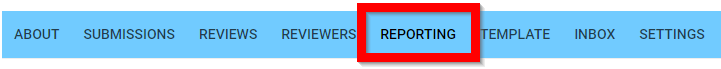
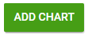
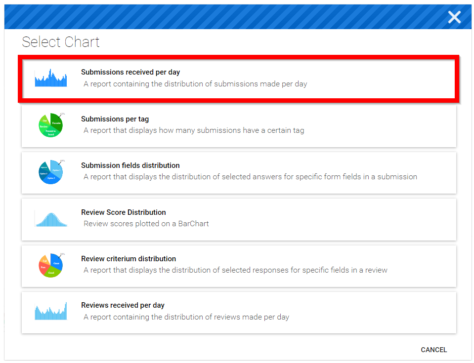
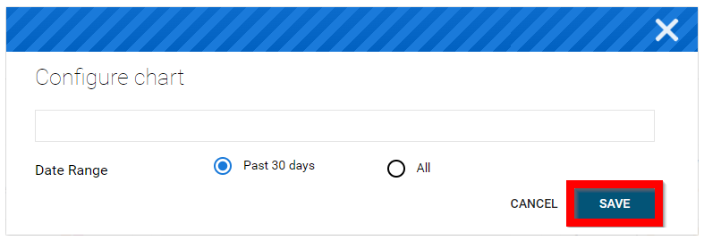

import { shareArticle } from '../../../components/share.js';
import { FaLink } from 'react-icons/fa';
import { ToastContainer, toast } from 'react-toastify';
import 'react-toastify/dist/ReactToastify.css';

export const ClickableTitle = ({ children }) => (
    <h1 style={{ display: 'flex', alignItems: 'center', cursor: 'pointer' }} onClick={() => shareArticle()}>
        {children} 
        <FaLink size="0.6em" />
    </h1>
);

<ToastContainer />

<ClickableTitle>Create a Call Report</ClickableTitle>

Call Reporting can be used to maintain an overview of the current status of your Calls. Generate custom reports on Submissions Received, Submission Field Distributions, Review Score Distribution and much more. With each generated report you will have the following options:

* **Edit** This allows you to modify the name of the Chart and how the data will be displayed
* **Move up** Moves the Chart placement up one position
* **Move down** Moves the Chart placement down one position
* **Remove** Removes the Chart from the Report

1. Select the desired call then navigate to the **Reporting** menu

2. Select **ADD CHART**

3. Select Chart by clicking on chart type

4. **Configure** the chart then select **SAVE** to open the newly configured chart

5. Select the **ellipses** (next to ADD Chart) for additional options:

* **Load Report** This will load a pre-saved report of your choice
* **Save Report** This allows you to save the current page view as a report to be used moving forward
* **Save Report As** This allows you to save your generated report with a new title from a previously saved report

