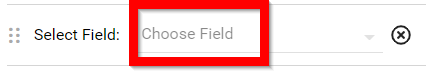
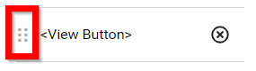

import { shareArticle } from '../../../components/share.js';
import { FaLink } from 'react-icons/fa';
import { ToastContainer, toast } from 'react-toastify';
import 'react-toastify/dist/ReactToastify.css';

export const ClickableTitle = ({ children }) => (
    <h1 style={{ display: 'flex', alignItems: 'center', cursor: 'pointer' }} onClick={() => shareArticle()}>
        {children} 
        <FaLink size="0.6em" />
    </h1>
);

<ToastContainer />

<ClickableTitle>Create a Query / Customize Your Interactive Spreadsheet</ClickableTitle>

Customizing the view on the table component is a very powerful feature that allows you to change which columns are being displayed, and gives you access to more fields, that you can easily filter/display.

For submissions, customizing the view allows you to add any field in the submission as a column. Assume you're viewing submissions from a call you just created, then customizing the view allows you to add any field from any section as a column, and each row would then display the value of that field in the particular submission.

Please note, it is recommended to have the VIEW button as the last displayed column.

1. Open the desired call

2. Select **SUBMISSIONS** from the menu bar

3. Select **CUSTOMIZE VIEW**

4. Scroll down a tad then select **ADD RESULT FIELD**this will create a new field to select from

5. Select **Choose Field** to populate into the table

6. To move the field select the **ellipses** then **drag and drop** on the desired order

7. To remove a field simply select the **x** in the row

8. By selecting **ADD FILTER CRITERIUM** you will be able to select a field then populate the filter options, please note you can filter in the table as well

9. Once you have completed the necessary changes select **APPLY** to save

