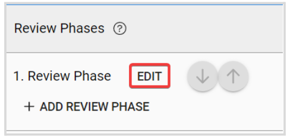
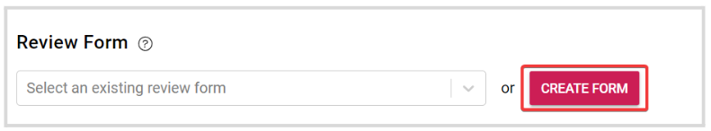
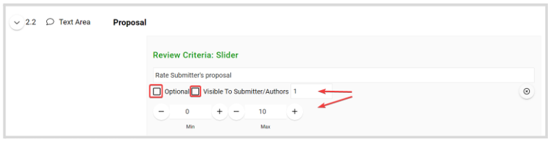

import React from 'react';
import { shareArticle } from '../../share.js';
import { FaLink } from 'react-icons/fa';
import { ToastContainer, toast } from 'react-toastify';
import 'react-toastify/dist/ReactToastify.css';

export const ClickableTitle = ({ children }) => (
    <h1 style={{ display: 'flex', alignItems: 'center', cursor: 'pointer' }} onClick={() => shareArticle()}>
        {children} 
        <FaLink size="0.6em" />
    </h1>
);

<ToastContainer />

<ClickableTitle>Create a Review Form</ClickableTitle>

Reviews on Submissions can be collected when Reviewers fill in their responses on a Review Form (designed by you). Custom Review Forms can be built by adding Review Criteria and Criteria weights to calculate an overall Review Score. Review Scores provide a simple metric to compare Submissions with, helping to eliminate bias.

1. From the desired call, click the **Template** tab from the top bar 

2. Click **Edit** next to the review phase 

3. You can select an existing form or click **Create From** to start from scratch 

4. From the review form editor view, you can add a review criteria either to a specific submission, a section, or to the submission form as a whole. Click **Add Review Criteria**

5. Select a [Review Field](https://docs-for-customers.slayte.com/hc/en-us/articles/4412806652435-Reviewer-Fields-Defined). You can also, decide if the field is **Optional**, if you will allow this field to be **Visible to Submitters/ Authors,** and its **Weights** and **Values.**Find more information on Review fields [here](https://docs-for-customers.slayte.com/hc/en-us/articles/4412806652435)

****

6. Once ready, click **Save This Form** 

7. Then click **Save** in the right top corner

