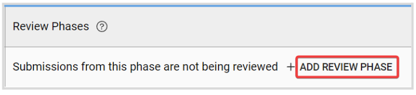
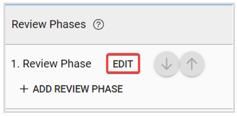

import React from 'react';
import { shareArticle } from '../../share.js';
import { FaLink } from 'react-icons/fa';
import { ToastContainer, toast } from 'react-toastify';
import 'react-toastify/dist/ReactToastify.css';

export const ClickableTitle = ({ children }) => (
    <h1 style={{ display: 'flex', alignItems: 'center', cursor: 'pointer' }} onClick={() => shareArticle()}>
        {children} 
        <FaLink size="0.6em" />
    </h1>
);

<ToastContainer />

<ClickableTitle>Create a Review Phase</ClickableTitle>

This step is Optional. Once you have collected Submissions to your Call, you may want to review them to streamline the process of deciding which to Accept/Reject. The Review Phase covers the period where Reviewers will evaluate Submissions and provide ratings on them.

To eliminate any bottlenecks in the Review process, reviews can be automatically assigned to a team of Reviewers based on assignment rules chosen by you.

## Create a Review Phase

1. Go t the desired call, and click the **Template** tab from the top bar 

2. In the **Review Phases** section, click **Add Review Phase**

****

3. Click **Edit** next to the Review Phase you have just added.

Under the Review Phase settings, you can modify the following: 

* **Times:** set a start and an end date
* **Review Form:** You create a form from scratch or select an existing one. This form will be used by Reviewers to complete their Reviews. More detailed steps [here](https://docs-for-customers.slayte.com/hc/en-us/articles/13721342204691)
* **Review Settings:**set up privacy levels for submitters and reviewers, find more information [here](https://docs-for-customers.slayte.com/hc/en-us/articles/115004360428-Review-Privacy-Settings), and review assignment allocation; find the detailed options [here](https://docs-for-customers.slayte.com/hc/en-us/articles/4413315125395-Assign-Reviewers)
* **Communication with Reviewers:**from here you can enable/disable event communication per phase basis by following [these steps](https://docs-for-customers.slayte.com/hc/en-us/articles/115004201207-Call-Configuration-Communication-Settings), set [E-mail blind-copy](https://docs-for-customers.slayte.com/hc/en-us/articles/13617910516499-E-mail-Blind-Copy-for-a-Call-Phase-), and [enable messaging](https://docs-for-customers.slayte.com/hc/en-us/articles/13199899852179-Enable-Call-Messaging-) function.

4. Click **Save** in the right top corner. 

