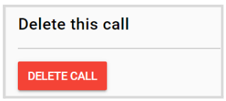
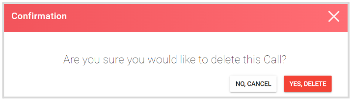

import { shareArticle } from '../../../components/share.js';
import { FaLink } from 'react-icons/fa';
import { ToastContainer, toast } from 'react-toastify';
import 'react-toastify/dist/ReactToastify.css';

export const ClickableTitle = ({ children }) => (
    <h1 style={{ display: 'flex', alignItems: 'center', cursor: 'pointer' }} onClick={() => shareArticle()}>
        {children} 
        <FaLink size="0.6em" />
    </h1>
);

<ToastContainer />

<ClickableTitle>Delete Call</ClickableTitle>

When no longer needed, you can delete a call altogether. Please note, this change is effective immediately and cannot be undone. 

1. Go to **Calls**, and click the call tile you want to delete  
2. Click the **Settings** tab, from the top bar  
3. Scroll down to the bottom of the page to the **Delete this call** section, and click **Delete Call** 

****

4. From the pop-up confirmation window, click **Yes, Delete**

Once done, you will be routed to the main Calls menu. 

