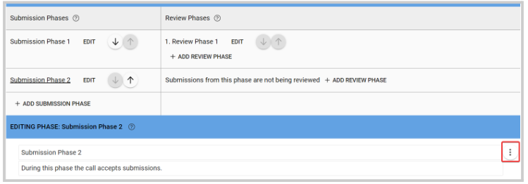

import { shareArticle } from '../../../components/share.js';
import { FaLink } from 'react-icons/fa';
import { ToastContainer, toast } from 'react-toastify';
import 'react-toastify/dist/ReactToastify.css';

export const ClickableTitle = ({ children }) => (
    <h1 style={{ display: 'flex', alignItems: 'center', cursor: 'pointer' }} onClick={() => shareArticle()}>
        {children} 
        <FaLink size="0.6em" />
    </h1>
);

<ToastContainer />

<ClickableTitle>Delete a Submission/ Review Phase</ClickableTitle>

In the case, you no longer require an additional submission or a review phase, you can delete it from the call settings. **Please note,** any submissions or reviews received for that phase will still be listed in the submissions and reviews tab, but no longer be accessible. 

1. Go to **Calls**, and locate the call you are looking to update 

2. Click **Template** from the top menu bar 

3. Click **Edit** next to the phase you want to delete 

4. From the **ellipsis button** to the right, select **Delete Phase**

5. Click **Save**

