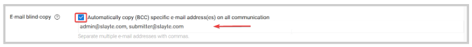

import React from 'react';
import { shareArticle } from '../../share.js';
import { FaLink } from 'react-icons/fa';
import { ToastContainer, toast } from 'react-toastify';
import 'react-toastify/dist/ReactToastify.css';

export const ClickableTitle = ({ children }) => (
    <h1 style={{ display: 'flex', alignItems: 'center', cursor: 'pointer' }} onClick={() => shareArticle()}>
        {children} 
        <FaLink size="0.6em" />
    </h1>
);

<ToastContainer />

<ClickableTitle>E-mail Blind Copy for a Call Phase</ClickableTitle>

Enable this function to blind/bcc-copy specific e-mail addresses for any event happening in a specific submission or renewal phase. You can add multiple email addresses in this field, make sure to separate each email address with a comma.

Whoever receives the original notification will not know that these email addresses also received the notification.

1. Go to **Calls**, and select the desired call to update 

2. Click the **Template** tab from the top bar 

3. Next to the submission/review phase, click **Edit**

4. Scroll down to the **Communication with Submitters/ reviewers** section

5. Mark the **checkbox**, and start typing an email or multiple email addresses as needed

6. Click **Save** at the right top corner 

