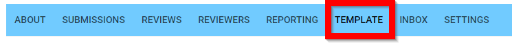
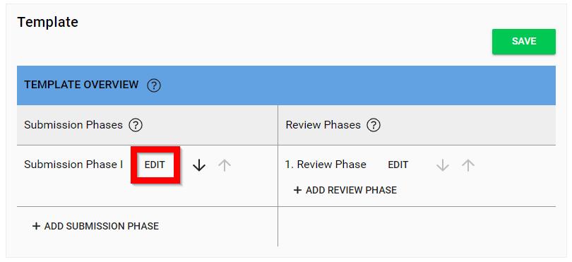
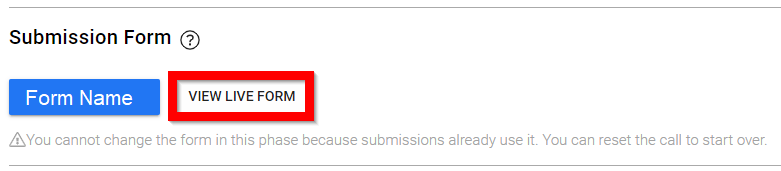
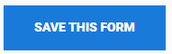
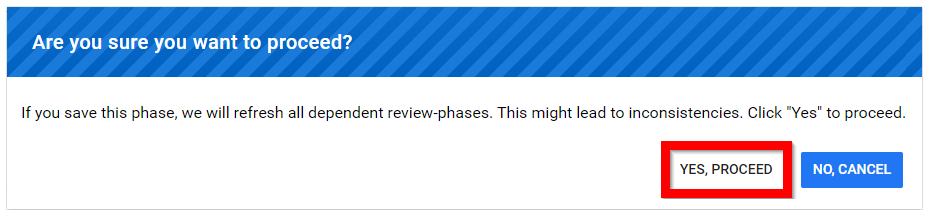
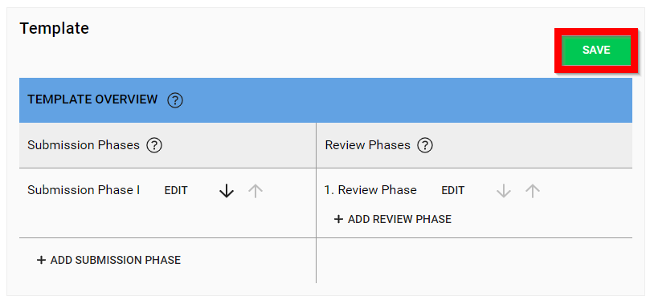

import React from 'react';
import { shareArticle } from '../../share.js';
import { FaLink } from 'react-icons/fa';
import { ToastContainer, toast } from 'react-toastify';
import 'react-toastify/dist/ReactToastify.css';

export const ClickableTitle = ({ children }) => (
    <h1 style={{ display: 'flex', alignItems: 'center', cursor: 'pointer' }} onClick={() => shareArticle()}>
        {children} 
        <FaLink size="0.6em" />
    </h1>
);

<ToastContainer />

<ClickableTitle>Edit a Live-Form</ClickableTitle>

Once you start receiving Submissions, editing a form can be important to fix grammatical errors and make additional changes as needed. Once you start receiving submissions, such modifications will make existing submissions invalid. This is why Slayte restricts the editing capabilities, though you can still make most changes.

The following list contains the changes that can be made to a Live Submission Form:

* Change the label of a field
* Change the content of a **Static Text** field
* Change the label of an option in a **Dropdown/Autocomplete/Radio Group/Checkbox**
* Hide a field
* Hide an option in a **Dropdown/Autocomplete/Radio Group/Checkbox**

Reasoning behind the limitation, consider you change the label of a question after you’ve received submissions to it. This may be handy for fixing minor errors such as grammatical errors, however if questions are changed linked to submissions that have already been received, this can completely change the meaning of intended answers from submitters. 

Invalid Modifications to the form would create errors with Call Reports and make existing submissions invalid, which include the following:

* Removing a submission field (please note, you do have the option to hide a field)
* Removing an option in a field (please note, you do have the option to hide a field)
* Reordering Fields (please note, you can hide fields and add new fields to the end)
* Reordering options in a field such as the drop down field option(s)

The changes listed above will make existing Submissions in your Call invalid, mainly because the internal structure of the Call changes once these modifications have been made.

1. Navigate to the desired **call**

2. Select the **Template** menu

3. Select **EDIT** on the desired submission phase (if applicable) 

4. Select **VIEW LIVE FORM**

5. Scroll down to the bottom of the form then select **EDIT**

6. Make necessary changes

7. After changes have been made select **SAVE THIS FORM**

8. Complete acknowledgement of changes be selecting **YES, PROCEED** (please note, the acknowledgement will only appear if there is a Review Phase in place

9. Select **SAVE** in the template to save all changes

