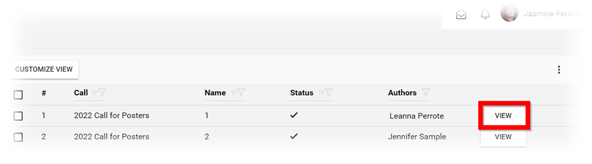
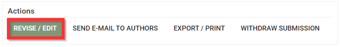
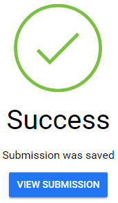

import { shareArticle } from '../../../components/share.js';
import { FaLink } from 'react-icons/fa';
import { ToastContainer, toast } from 'react-toastify';
import 'react-toastify/dist/ReactToastify.css';

export const ClickableTitle = ({ children }) => (
    <h1 style={{ display: 'flex', alignItems: 'center', cursor: 'pointer' }} onClick={() => shareArticle()}>
        {children} 
        <FaLink size="0.6em" />
    </h1>
);

<ToastContainer />

<ClickableTitle>Edit a Submitter's Submission</ClickableTitle>

Making changes to submissions may be useful for fixing grammatical errors or adjusting previously submitted information. As an administrator, you can either make changes to the submission yourself or you can [Allow Users to Edit Submissions](https://docs-for-customers.slayte.com/hc/en-us/articles/4412149700627).

1. Navigate to the **Call** holding the submission you would like to modify or select from the **Submissions** tab

2. Click **View** on the Submission you would like to edit

3. From the submission detail, select the action **REVISE/EDIT**

4. You have been redirected to the submission to make the necessary **edits**

5. When finished, click **SAVE**

6. You will then be able to **VIEW SUBMISSION** or navigate elsewhere

