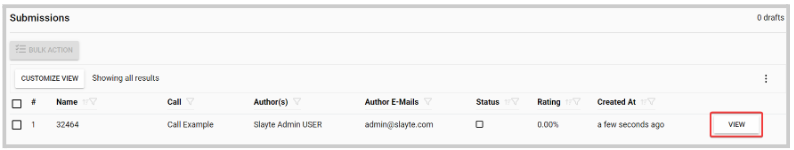

import { shareArticle } from '../../../components/share.js';
import { FaLink } from 'react-icons/fa';
import { ToastContainer, toast } from 'react-toastify';
import 'react-toastify/dist/ReactToastify.css';

export const ClickableTitle = ({ children }) => (
    <h1 style={{ display: 'flex', alignItems: 'center', cursor: 'pointer' }} onClick={() => shareArticle()}>
        {children} 
        <FaLink size="0.6em" />
    </h1>
);

<ToastContainer />

<ClickableTitle>Email Submitter(s)</ClickableTitle>

As an Administrator, you can communicate by sending an email to only the submitters/Authors/Co-Authors of a specific submission. 

1. Navigate to the **Call** holding the submission you would like to ***email*** 

2. Click **View** on the submission you would like to email

3. Locate the **Actions** section, and click **Send E-Mail To Authors**

****

4. From the pop-up window, you can select: 

* **Recipient(s):** All Co-Authors, Submitter or All Primary Authors
* **Select E-Mail:** you can select from an existing template or **write my own message** to start from scratch
* **Send me a copy:** for you to receive a copy of the message to your primary email

5. Click **Send** when ready 

6. You will receive the following confirmation message 

Note: you can also Bulk email submitters for several or all submissions at once. For more information, go [here](https://docs-for-customers.slayte.com/hc/en-us/articles/4416092806547)

