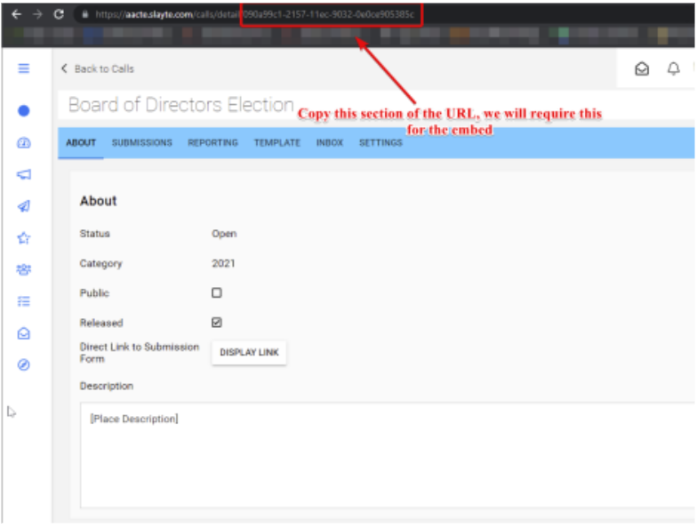
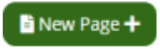
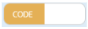
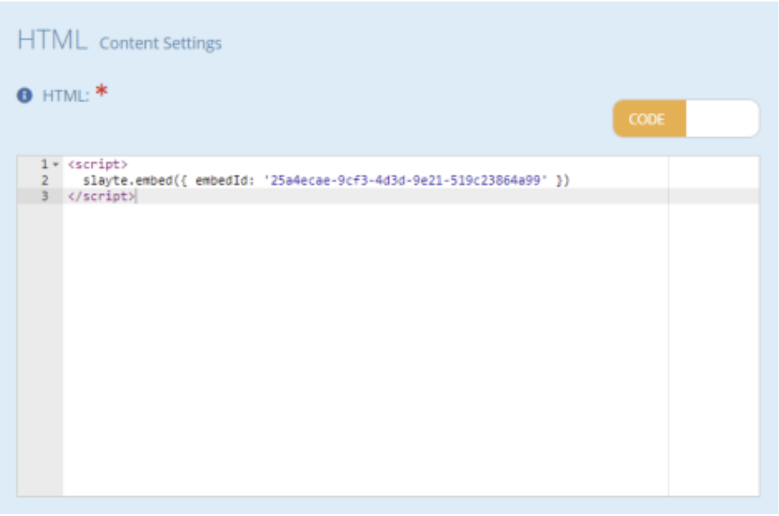

import { shareArticle } from '../../../components/share.js';
import { FaLink } from 'react-icons/fa';
import { ToastContainer, toast } from 'react-toastify';
import 'react-toastify/dist/ReactToastify.css';

export const ClickableTitle = ({ children }) => (
    <h1 style={{ display: 'flex', alignItems: 'center', cursor: 'pointer' }} onClick={() => shareArticle()}>
        {children} 
        <FaLink size="0.6em" />
    </h1>
);

<ToastContainer />

<ClickableTitle>Embedding Slayte Call Forms in Impexium Sites</ClickableTitle>

Slayte has the ability to integrate itself with Impexium and be embed in Impexium Sites, there’s  configuration from both ends involved but very straight forward. 

## Configuration from Slayte

First, we need to identify the call form we wish to embed and extract the Call UID. To do this, simply open the desired call and look at the URL: 

Next, let’s create the Slayte embed for this specific call to be setup in an Impexium page. 

1. Let’s head over to Administration icon on the left-hand navigation bar.
2. Click under **Design** and then **Embedding**.
3. Click on 
4. Under **Label**, let’s give it a name that it’s easy for you to identify.
5. Under Type, select the type of embedding that suits your needs:                                                         **a. Call Detail:** This embeds the landing page of the specific call, where the users can see the landing page of the call, including the description of it.                                                                      **b.** **Submission Form:** This embeds the actual form itself directly into the site, so it’s immediately visible to the users.                                                                                                        **c. Submission Library:** This shows a repository of all the submissions that have been approved in Slayte, this is more akin, for staff internal review.
6. Select if Active or Inactive, if Inactive a placeholder will be rendered until the call is active. Choose Active for this case.
7. Enter the Call UUID previously gathered from the call in this field.
8. Under **Plugins** choose **Impexium**.
9. Under Login Automatically, you can choose if Slayte will automatically log in with the existing  Slayte session.
10. Prevent users from leaving the site can be enabled if you want to prevent the users for navigating outside of the embed, this is primarily useful when embedding a specific call form in a page
11. Click to commit the changes.
At the bottom section, you will notice an **Embed Code**, which contains the code we will be using in  Impexium.

## Configuration from Impexium

With the Slayte embed configured, we just need to embed the previously obtained code in Impexium Web Sites. Follow these steps: 

1. Login to the Impexium Administration Console.
2. On the left-hand navigation bar, click on 
3. Choose the Main site and click 
4. Create a new website page by clicking the  button.
5. Under the newly created page, click under Page Content tab.
6. Choose the location of where the content will be displayed and click the 

button to add a  content item in the page.
7. Under Content type search for Submissions and click at the bottom
8. Click the button and under HTML Content Settings section, click the switch button to  change to 
9. Lastly, under the box presented, paste the code previously obtained from the Slayte Embed  Configuration and Paste it in the Code Box.

10. Click the  button to commit the changes.

Your Impexium website with Slayte Embed is now ready.

