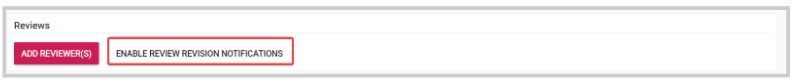
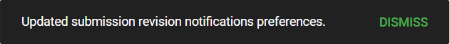

import { shareArticle } from '../../../components/share.js';
import { FaLink } from 'react-icons/fa';
import { ToastContainer, toast } from 'react-toastify';
import 'react-toastify/dist/ReactToastify.css';

export const ClickableTitle = ({ children }) => (
    <h1 style={{ display: 'flex', alignItems: 'center', cursor: 'pointer' }} onClick={() => shareArticle()}>
        {children} 
        <FaLink size="0.6em" />
    </h1>
);

<ToastContainer />

<ClickableTitle>Enable/Disable Review Revision Notifications</ClickableTitle>

As an Administrator, you can enable/disable the function for reviewers to be able to unsubscribe from revision notifications on an individual submission basis.

1. From the Call holding the submission to update, go to **Submissions**

2. Locate the submission and click **View**

3. Scroll down to the Reviews section, and click **Enable/Disable Review Revision Notifications**

****

4. You will receive the following confirmation once successfully updated

