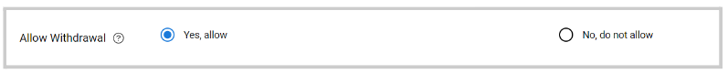

import { shareArticle } from '../../../components/share.js';
import { FaLink } from 'react-icons/fa';
import { ToastContainer, toast } from 'react-toastify';
import 'react-toastify/dist/ReactToastify.css';

export const ClickableTitle = ({ children }) => (
    <h1 style={{ display: 'flex', alignItems: 'center', cursor: 'pointer' }} onClick={() => shareArticle()}>
        {children} 
        <FaLink size="0.6em" />
    </h1>
);

<ToastContainer />

<ClickableTitle>Enable/Disable Submission Withdraw</ClickableTitle>

Depending on your Call requirements, as an Administrator; you can allow or restrict submitters to withdraw their submissions per submission phase basis. To do so, follow these steps: 

1. Go to **Calls**, and locate the desired call 

2. Click **Template** from the top bar 

3. Next to the submission phase you would like to update, click **Edit**

4. On the **Submission Settings**section, scroll down to **Allow Withdrawal**

5. Check the radio button to **Yes, allow,** or **No, do not allow**

****

Note: when creating a Call, this option is set to Yes, allow by default. 

6. Click **Save** in the right top corner. 

