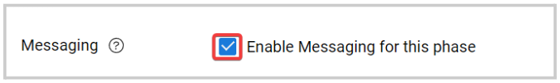
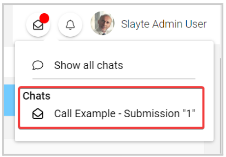

import { shareArticle } from '../../../components/share.js';
import { FaLink } from 'react-icons/fa';
import { ToastContainer, toast } from 'react-toastify';
import 'react-toastify/dist/ReactToastify.css';

export const ClickableTitle = ({ children }) => (
    <h1 style={{ display: 'flex', alignItems: 'center', cursor: 'pointer' }} onClick={() => shareArticle()}>
        {children} 
        <FaLink size="0.6em" />
    </h1>
);

<ToastContainer />

<ClickableTitle>Enable Call Messaging</ClickableTitle>

You can enable in-app messaging between Administrators, submitters, and/or reviewers (if applicable) for a submission or review phase in specific. 

1. Go to **Calls**, and select the desired call

2. Click **Template** from the top bar 

3. Next to the phase you want to update, click **Edit**

4. Under the **Communication with Submitter** or **Communication with Reviewers,**locate the **Messaging** and click the checkbox to **Enable Messaging for this phase**

****

5. Select which user roles are automatically added to a channel as members: Admin, Submitters Reviewers (On assignment) 

6. Click **Save** in the right top corner

New message notifications will be displayed in the right top corner, next to the profile section. It will show the Call and submission name to which the message is related to, or you can click **Show all Chats**. For more information on how to manage All Chats, go [here](https://docs-for-customers.slayte.com/hc/en-us/articles/4799566104467-Show-All-Chat-Request-s-)

