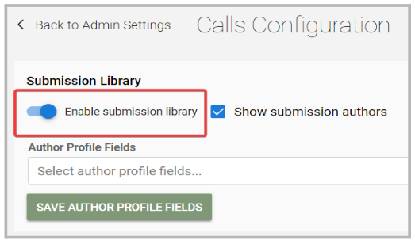

import React from 'react';
import { shareArticle } from '../../share.js';
import { FaLink } from 'react-icons/fa';
import { ToastContainer, toast } from 'react-toastify';
import 'react-toastify/dist/ReactToastify.css';

export const ClickableTitle = ({ children }) => (
    <h1 style={{ display: 'flex', alignItems: 'center', cursor: 'pointer' }} onClick={() => shareArticle()}>
        {children} 
        <FaLink size="0.6em" />
    </h1>
);

<ToastContainer />

<ClickableTitle>Enable Submission Library</ClickableTitle>

As an Administrator, you can enable “Submissions Library” to be able to create libraries that will include only pre-selected data for a specific Call; for all users to access these submissions from their Slayte portal. 

To enable this function, from the left side menu click “Admin” and under the Calls section click “Configuration”

Click to toggle ON - “Enable submissions library” 

Next, go to Calls > select a Call > Settings and click Edit. Click the checkbox next to “Enable”. It will display the specific parameter to use for this library: 

* Source phase: Select a phase from which submissions will be added to the library
* Submission Title: Select a field that will be set as the submission's title in the submission library.
* Submission Detail: Select field(s) whose values will be displayed in the submission library.
* Search Fields: Select field(s) that users can search submissions by.

Once selected, click “Save”. 

An additional icon for “Submission Library” will be available from where the previously created library can be selected. 

To locate a submission, enter the details on any of the search fields > click Search.

A list of submissions with the selected criteria will be displayed > click View for more details. 

