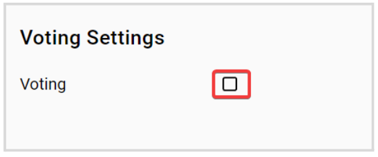
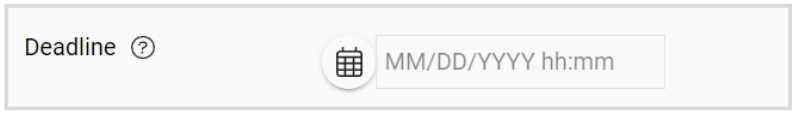
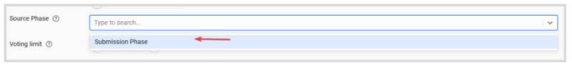
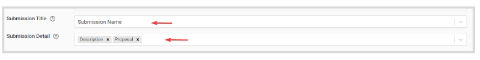
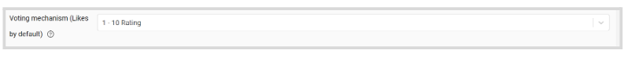
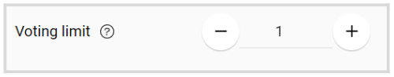
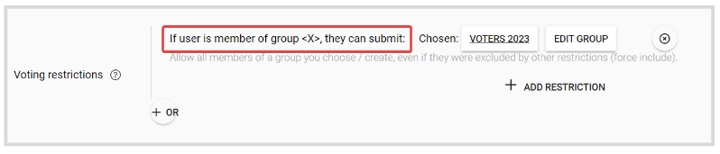
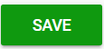

import React from 'react';
import { shareArticle } from '../../share.js';
import { FaLink } from 'react-icons/fa';
import { ToastContainer, toast } from 'react-toastify';
import 'react-toastify/dist/ReactToastify.css';

export const ClickableTitle = ({ children }) => (
    <h1 style={{ display: 'flex', alignItems: 'center', cursor: 'pointer' }} onClick={() => shareArticle()}>
        {children} 
        <FaLink size="0.6em" />
    </h1>
);

<ToastContainer />

<ClickableTitle>Enable Submissions Voting</ClickableTitle>

Enabling voting lets you gather ratings for submissions collected on a specific call. Find the steps to follow below: 

1. From the desired call, go to the **Settings**tab 

2. Click **Edit** on the right-top corner

3. Scroll down to locate the **Voting Settings** and check the box to **Enable**

4. By default, only submissions that have been set to accept votes are visible to voters. Check **Show All Submissions** to display all submissions in the call instead

5. Set a **D****eadline** for when votes will be accepted

6. Select the **phase** where the submissions were collected that you'd like to collect votes for

7. Select what submitters see as the **title** of the item to vote for. The title will be displayed on the list, but voters can still open each submission to see the list of visible fields. Also, decide which **fields of the submissio**n will be shown to the voter. Note, you can select multiple fields

8. Choose a **Voting mechanism** from the drop-down menu. Note, the available options are: Upvote, Like, Star Rating 1-5, or 1-10 Rating

9. Set how many votes each user can submit 

10. Add **restrictions** to allow only matching users to cast a vote. By default, every registered user is allowed to vote. Click **Add Restriction** to select the criteria to use 

11. Click **Save** on the right-top corner 

