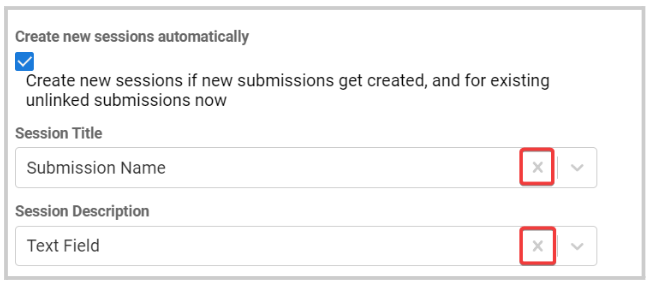

import React from 'react';
import { shareArticle } from '../../share.js';
import { FaLink } from 'react-icons/fa';
import { ToastContainer, toast } from 'react-toastify';
import 'react-toastify/dist/ReactToastify.css';

export const ClickableTitle = ({ children }) => (
    <h1 style={{ display: 'flex', alignItems: 'center', cursor: 'pointer' }} onClick={() => shareArticle()}>
        {children} 
        <FaLink size="0.6em" />
    </h1>
);

<ToastContainer />

<ClickableTitle>Export/Link submissions to an Event from a Call</ClickableTitle>

All the data gather via submissions on a Call, can be exported/linked to your event to be easily used to create sessions or sub-sessions. 

1. From the desired call, click the **Submission** tab from the top bar 

2. Click the **ellipsis** button on the right top corner, and select **Export/Link submissions to Event**

****

3. Search the event to link to by name 

4. From here, you can select the following export/link types:

* Submissions as new sessions: you will be required to select some of the submissions or all that you would like to create a separate session for.
* Submissions as new sub-session on an existing session: you will be required to search by name the existing session to create the sub-session for, to then select the submissions that apply
* A single submission to an existing session: you can only select 1 submission to link to an existing session.

5. Fill in the mapping 

6. Scroll down to **Synchronize data**, and select:

* Link Call and Event: Synchronizes call and event. Any changes on submissions will be reflected on linked sessions.
* Import submission(s) only: Data from the submission will be imported now, but future changes on the submission will not affect the session(s).

7. Click **Link**

Depending on the selected link type, the new sessions or sub-sessions are automatically created in the selected event, and if a mapping was selected; any linked fields are only editable on the linked submission.

If after the export, you no longer want to have the submissions link to the sessions/sub-sessions you can remove the mapping of these fields to be able to edit/manage them directly from the event sessions. You can follow these steps: 

1. From the sessions list, click the **Linked to # Calls** button 

2. Click the Call name to modify 

3. Unlink by removing the previously selected fields, by clicking the X to the right 

4. Click **Save**

