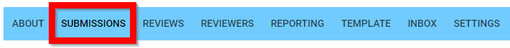
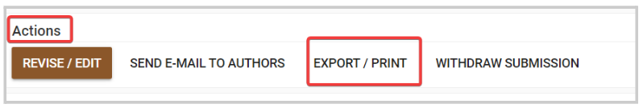
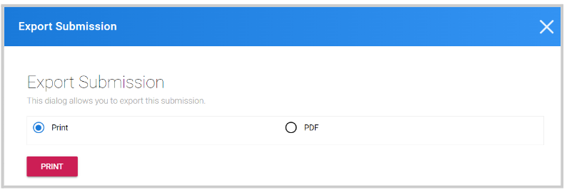

import { shareArticle } from '../../../components/share.js';
import { FaLink } from 'react-icons/fa';
import { ToastContainer, toast } from 'react-toastify';
import 'react-toastify/dist/ReactToastify.css';

export const ClickableTitle = ({ children }) => (
    <h1 style={{ display: 'flex', alignItems: 'center', cursor: 'pointer' }} onClick={() => shareArticle()}>
        {children} 
        <FaLink size="0.6em" />
    </h1>
);

<ToastContainer />

<ClickableTitle>Export/Print a Single Submission</ClickableTitle>

Alternatively, you can export individual Submissions to be downloaded/printed as PDF files. This opens your browser’s printing dialogue that allows you to save the Submission as a PDF or send it to a printer. 

1. Open the desired call  
2. Select **SUBMISSIONS** from the menu bar

  
3. Select **View** next to the desired submission (please note, if you removed the View button from the query, you can add it back any time)

4. You will be **redirected** to the specific submission 

5. Locate the **Actions** section, and click **Export/ Print**

6. Select **Print** when ready

