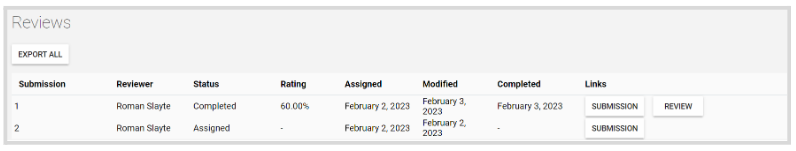
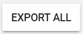
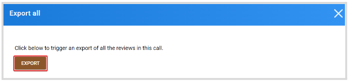
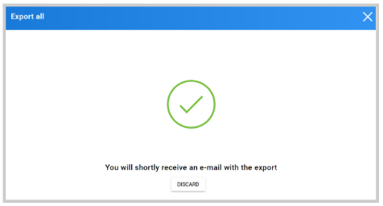

import React from 'react';
import { shareArticle } from '../../share.js';
import { FaLink } from 'react-icons/fa';
import { ToastContainer, toast } from 'react-toastify';
import 'react-toastify/dist/ReactToastify.css';

export const ClickableTitle = ({ children }) => (
    <h1 style={{ display: 'flex', alignItems: 'center', cursor: 'pointer' }} onClick={() => shareArticle()}>
        {children} 
        <FaLink size="0.6em" />
    </h1>
);

<ToastContainer />

<ClickableTitle>Export Reviews</ClickableTitle>

1. Go to **Calls**, and select the call holding the reviews 

2. Click the **Reviews** tab from the top bar 

From here, you will see the list of all reviews to date including details such as: submission name and link, reviewer's name, review status, rating, when the review was assigned and modified and if it has been completed with a link to the review.

3. Click **Export All**

****

4. From the pop-up confirmation window, click **Export**

5. You will receive the following confirmation message. The review report will be sent to your email and attached as a CSV file. 

