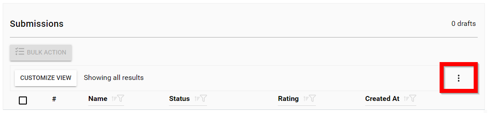
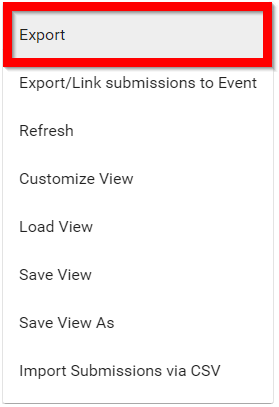
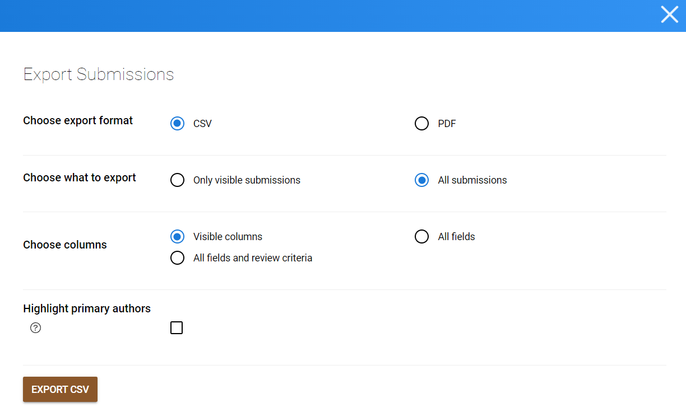
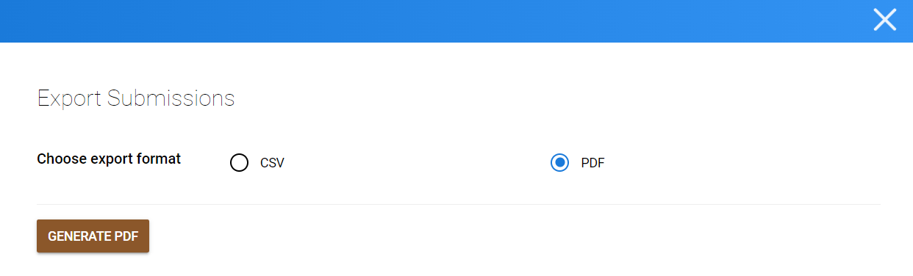

import { shareArticle } from '../../../components/share.js';
import { FaLink } from 'react-icons/fa';
import { ToastContainer, toast } from 'react-toastify';
import 'react-toastify/dist/ReactToastify.css';

export const ClickableTitle = ({ children }) => (
    <h1 style={{ display: 'flex', alignItems: 'center', cursor: 'pointer' }} onClick={() => shareArticle()}>
        {children} 
        <FaLink size="0.6em" />
    </h1>
);

<ToastContainer />

<ClickableTitle>Export Submission(s)</ClickableTitle>

1. Navigate to the desired **call**

2. Select the **Submissions** tab menu option

3. Select the **ellipses** on the top right

4. Click **Export**

5. Select the **export format**you prefer (CSV or PDF)

6. When selecting CSV, choose whether you would like to export the Submissions visible in your current View or All Submissions

* **Only Visible submissions** will export the Submissions that are currently displayed in your Submission List View.
* **All Submissions** will provide you with the options to export:
	+ **Visible Columns** will export all the Submissions in your Call for the columns that are currently in the Submission List View.
	+ **All Fields** will export all the collected responses for each Form Field added to your Submission Form.
	+ **All Fields and Review Criteria** will export all collected answers from every Submission Field and Review Field.
* **Highlight primary authors** will export with an asterisk.

6. Click **EXPORT CSV**

7. If selecting PDF, click **GENERATE PDF**

