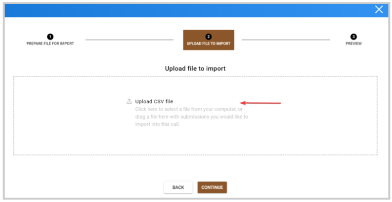
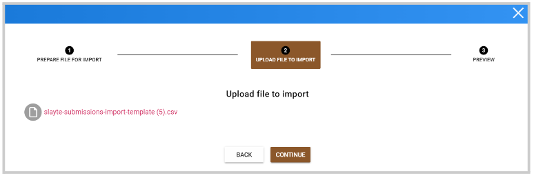
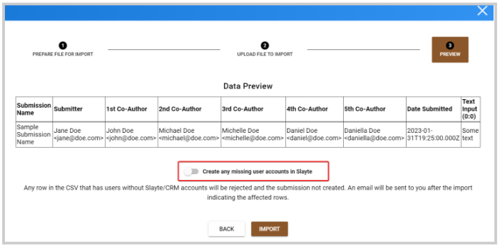
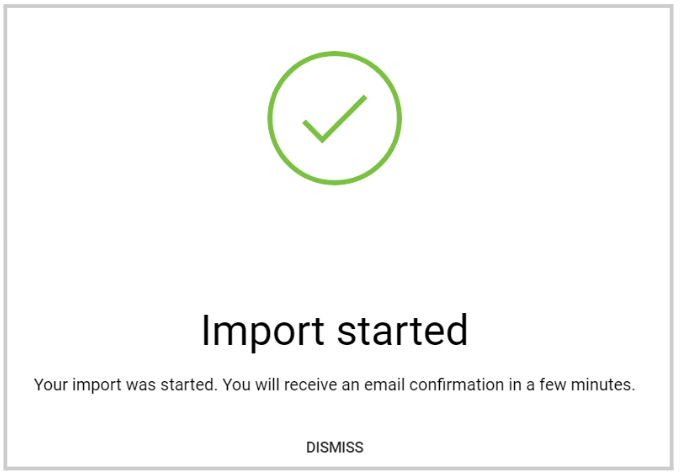

import { shareArticle } from '../../../components/share.js';
import { FaLink } from 'react-icons/fa';
import { ToastContainer, toast } from 'react-toastify';
import 'react-toastify/dist/ReactToastify.css';

export const ClickableTitle = ({ children }) => (
    <h1 style={{ display: 'flex', alignItems: 'center', cursor: 'pointer' }} onClick={() => shareArticle()}>
        {children} 
        <FaLink size="0.6em" />
    </h1>
);

<ToastContainer />

<ClickableTitle>Import Submissions via CSV</ClickableTitle>

1. Go to **Calls**, and select the desired call 

2. Click the **Submissions** tab from the top bar 

3. Click the **ellipsis** button to the right, and select from the pop-up menu **Import Submissions via CSV**

4. Select the **Phase to import** to. 

5. /*Optional. You can download a template file, to fill in your values; which is prepared with the correct column titles already. Or click **Continue**to **upload** a file by clicking in the upload section or dragging a file 

5. Once uploaded, click **Continue**

6. A preview of the submissions will be displayed. Here, you can also decide if a new user will be created if it doesn't exist yet at the moment of the import by toggling ON - **Create any missing user accounts in Slayte.**

****

7. When ready, click **Import**

8. A pop-up confirmation will appear, click **Dismiss**. 

