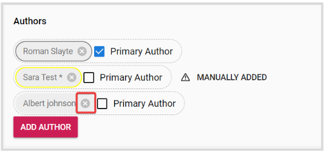

import React from 'react';
import { shareArticle } from '../../share.js';
import { FaLink } from 'react-icons/fa';
import { ToastContainer, toast } from 'react-toastify';
import 'react-toastify/dist/ReactToastify.css';

export const ClickableTitle = ({ children }) => (
    <h1 style={{ display: 'flex', alignItems: 'center', cursor: 'pointer' }} onClick={() => shareArticle()}>
        {children} 
        <FaLink size="0.6em" />
    </h1>
);

<ToastContainer />

<ClickableTitle>Manage Authors/ Co-Authors on behalf of Submitters</ClickableTitle>

As an Administrator, you can allow submitters to add co-authors by searching from the existing users or even add a new/missing user to a submission. For detailed steps on how to enable Co-Author Collaboration, go [here](https://docs-for-customers.slayte.com/hc/en-us/articles/4413415256851-Allow-Co-Author-Collaboration) 

From within a submission, you can add/remove Co-authors, and primary authors and re-arrange them as needed. Under the Actions section, click **Revise/Edit**

## Add a co-author

Click **Add Author**, and search the user by name or email address. Click **Done**, and then **Save** at the bottom. 

## Remove a Co-author

Click the **X** button next to the author to delete, then click **Save**. 

## Assign/unassign Primary Author

**Check/uncheck** the Primary Author checkbox next to each author's name. Note, you can have as many Primary Authors as desired. Click **Save** once ready. 

## Re-arrange Authors

You can **drag and drop** authors in a desired order. Click **Save** to complete the changes. 

## Manually Added Users by the Submitter

When allowed, the submitter can add a new/missing user when initially submitting. These users are required to confirm their participation, in the meantime, you can confirm their pending status with a yellow frame around their name and the **Manually Added** button that will display their name, email address, and comments from the submitter about this user.

As an Administrator, you cannot override the pending status. For these users, however, you can still manage them with any of the above actions.

