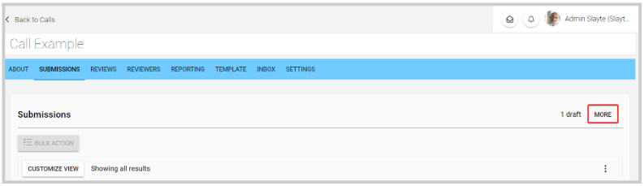
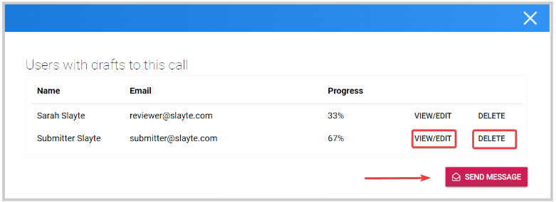
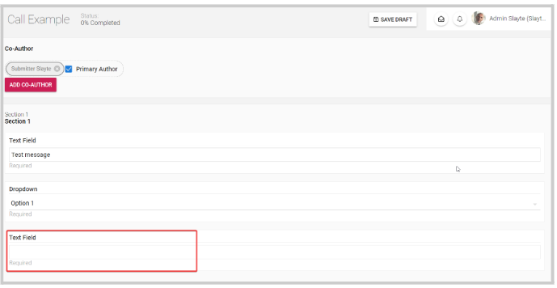
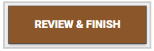
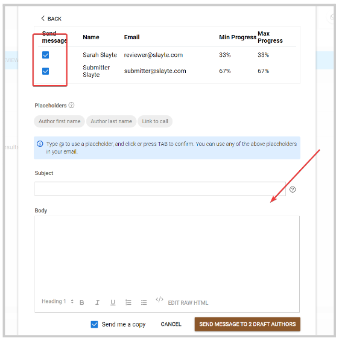

import React from 'react';
import { shareArticle } from '../../share.js';
import { FaLink } from 'react-icons/fa';
import { ToastContainer, toast } from 'react-toastify';
import 'react-toastify/dist/ReactToastify.css';

export const ClickableTitle = ({ children }) => (
    <h1 style={{ display: 'flex', alignItems: 'center', cursor: 'pointer' }} onClick={() => shareArticle()}>
        {children} 
        <FaLink size="0.6em" />
    </h1>
);

<ToastContainer />

<ClickableTitle>Manage End-Users Drafts Submissions</ClickableTitle>

Some Submitters may complete their Submissions halfway and save the remainder as a Submission Draft. As an Administrator, you can view and manage a submitter's draft submissions.

If you would like to view the drafts that are currently pending in your Call:

1. Go to the **Call** you would like to view pending drafts in
2. Click on the **Submissions** tab. On the right top corner, click **More** to display all drafts

From there, you can see some information about the submissions such as the submitter's name/email, and the progress of the submission so far. As an administrator, you have the option to **View/Edit**, **Delete** or **Send Message** to these draft submitters

### **View/Edit**

This will allow you to view the progress and edit/complete the submission on behalf of the submitter

Once you complete all the blank fields, click 

### **Delete**

By clicking the Delete button, the Drafts will be immediately deleted.

### **Send Message**

You will be able to send a message to all or some submitters about their drafts. First, use the **checkboxes** to select which draft submitters you would like to send a message to, then once the message is created, click **Send Message to**

