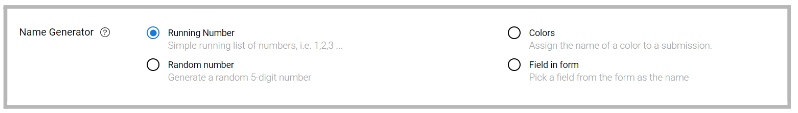
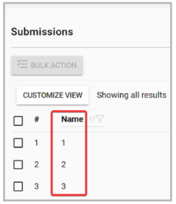
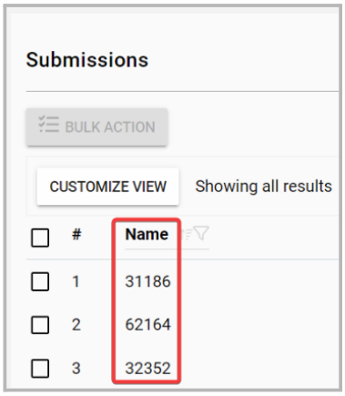
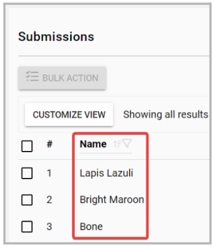
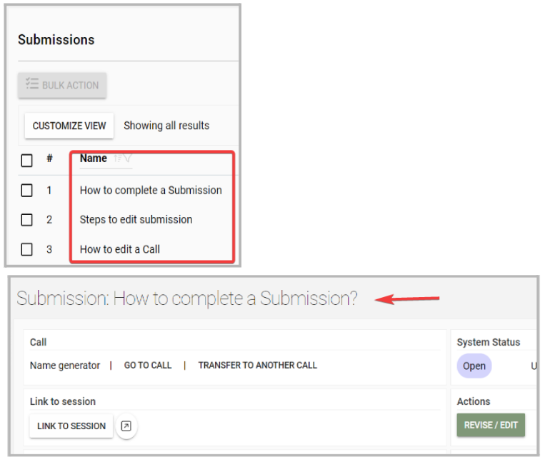

import { shareArticle } from '../../../components/share.js';
import { FaLink } from 'react-icons/fa';
import { ToastContainer, toast } from 'react-toastify';
import 'react-toastify/dist/ReactToastify.css';

export const ClickableTitle = ({ children }) => (
    <h1 style={{ display: 'flex', alignItems: 'center', cursor: 'pointer' }} onClick={() => shareArticle()}>
        {children} 
        <FaLink size="0.6em" />
    </h1>
);

<ToastContainer />

<ClickableTitle>Name Generator Field</ClickableTitle>

As an Administrator, you can specify how to name or identify each received submission on a submission phase basis. 

From the Template tab > Submission Phase > Edit, locate the “Name Generator” section

Where you can select the following options: 

* Running Number: a simple running list of numbers will be assigned to the submissions in the order they are received. i.e. 1,2,3 ..

* Generate a random 5-digit number: a random 5-digit number will be generated and assigned.

* Colors: Assign the name of a color to a submission

* Field in form: you can select a specific field of the submission form to be assigned as the name. For example - A custom field designated as "Paper Title"

Note: If the selected field is modified, the submission name will not be updated and will remain the same as it was originally submitted. 

