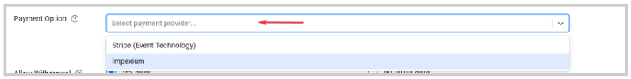
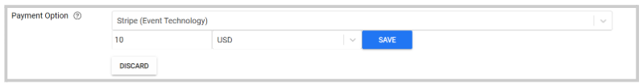
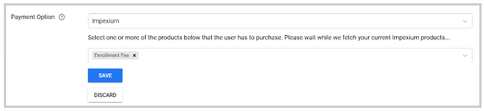

import { shareArticle } from '../../../components/share.js';
import { FaLink } from 'react-icons/fa';
import { ToastContainer, toast } from 'react-toastify';
import 'react-toastify/dist/ReactToastify.css';

export const ClickableTitle = ({ children }) => (
    <h1 style={{ display: 'flex', alignItems: 'center', cursor: 'pointer' }} onClick={() => shareArticle()}>
        {children} 
        <FaLink size="0.6em" />
    </h1>
);

<ToastContainer />

<ClickableTitle>Payment Options for Submissions</ClickableTitle>

You can configure to enforce that to make a submission to a specific call, a payment has to be made via a payment provider (e.g. Impexium, or Stripe) and selected product.

1. Go to **Calls**, and select the desired call 

2. Click **Template** from the top bar 

3. On the **Submissions Settings** section, locate **Payment Option**and select a **Payment Provider** from the drop-down list

****

4. Depending on the payment provider, fill in as follows: 

* Stripe: enter the amount to charge and the currency.

* Impexium: select one or more of the products that the user has to purchase via Impexium

