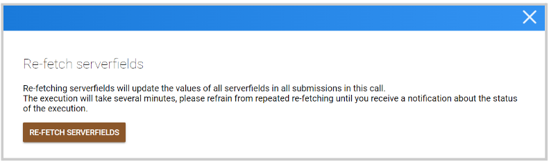
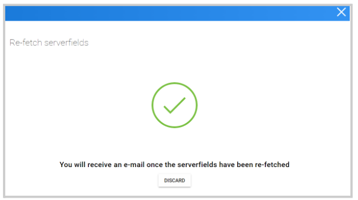

import { shareArticle } from '../../../components/share.js';
import { FaLink } from 'react-icons/fa';
import { ToastContainer, toast } from 'react-toastify';
import 'react-toastify/dist/ReactToastify.css';

export const ClickableTitle = ({ children }) => (
    <h1 style={{ display: 'flex', alignItems: 'center', cursor: 'pointer' }} onClick={() => shareArticle()}>
        {children} 
        <FaLink size="0.6em" />
    </h1>
);

<ToastContainer />

<ClickableTitle>Refetch Serverfields for All Submissions</ClickableTitle>

As an Administrator you can re-fetch all serverfields of all submissions in a specific call, this will update said fields to their new value. Keep in mind, this change can't be undone.

1. Go to **Calls**, and select the desired call 

2. Click **Settings** from the top bar 

3. Scroll down to locate **Refetch Serverfields for all submissions** and click **Re-Fetch** 

4. From the pop-up confirmation window, click **Re-Fetch Serverfields**

5. Additionally, an email notification will be sent once the update has been completed 

