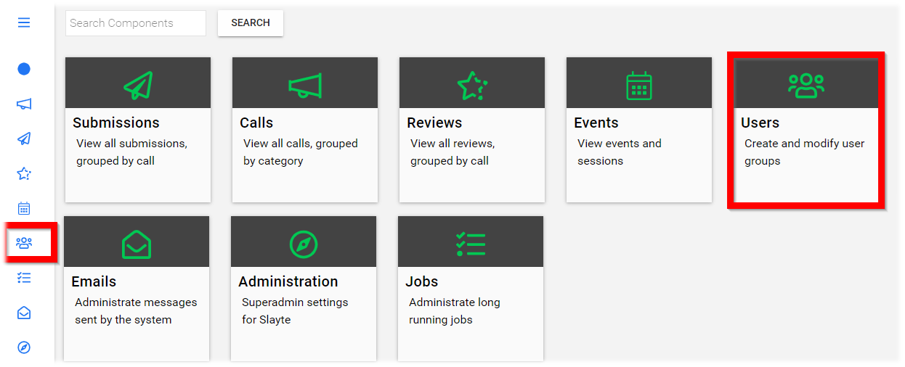
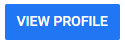
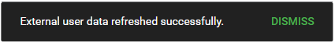

import { shareArticle } from '../../../components/share.js';
import { FaLink } from 'react-icons/fa';
import { ToastContainer, toast } from 'react-toastify';
import 'react-toastify/dist/ReactToastify.css';

export const ClickableTitle = ({ children }) => (
    <h1 style={{ display: 'flex', alignItems: 'center', cursor: 'pointer' }} onClick={() => shareArticle()}>
        {children} 
        <FaLink size="0.6em" />
    </h1>
);

<ToastContainer />

<ClickableTitle>Refresh External Data</ClickableTitle>

1. From the Home page select **Users** either from the left menu or the Users tile

2. Type in the **name or email address** of desired user in the **search field** - Please note, do not hit enter on keyboard.

3. Select **VIEW PROFILE**

4. Scroll down to select **Refresh External Data**

5. Dismiss **External user data refreshed successfully** notification or wait for auto-dismiss

6. Select **X** to close the user's profile

